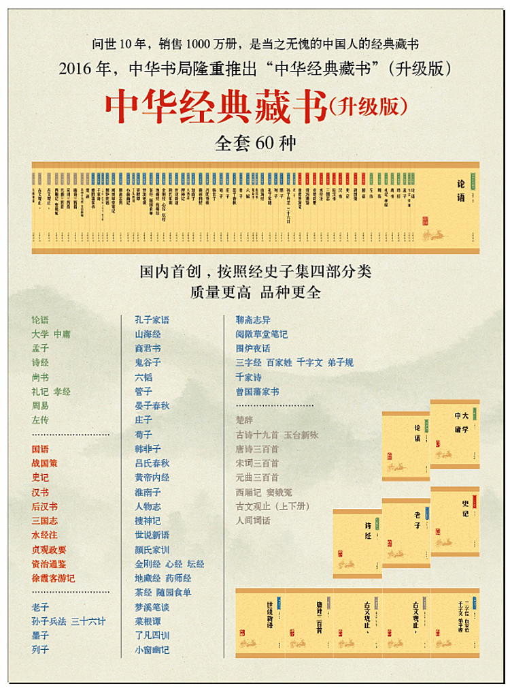

# 中华经典藏书-中华书局

《中华经典藏书(套装共60册)》



```text
战国策
论语
孟子
大学 中庸
诗经
尚书
礼记 孝经
周易
老子
墨子
晏子春秋
曾子 子思子
孔丛子
庄子
管子
荀子
列子
韩非子
孙子兵法 孙膑兵法
六韬 鬼谷子
商君书
吕氏春秋
淮南子
孔子家语
颜氏家训
金刚经 心经 坛经
地藏经 药师经
黄帝内经
搜神记
人物志
世说新语
梦溪笔谈
左传
国语
史记
汉书
后汉书
三国志
资治通鉴
水经注
徐霞客游记
山海经
贞观政要
三字经 百家姓 千字文 弟子规
楚辞
古文观止（全2册）
唐诗三百首
宋词三百首
元曲三百首
千家诗
```