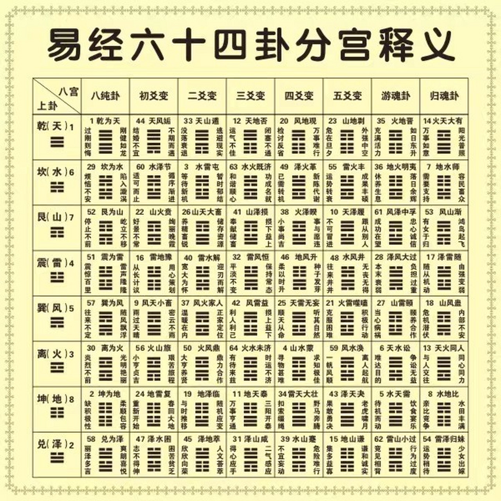
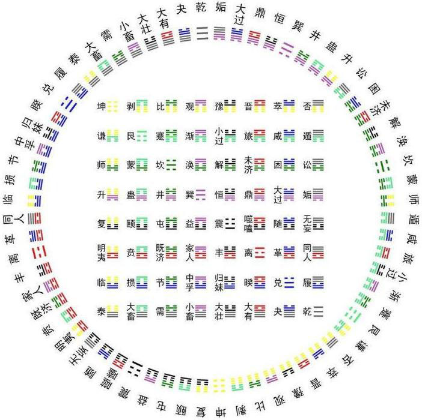
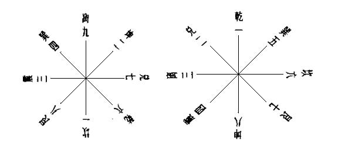
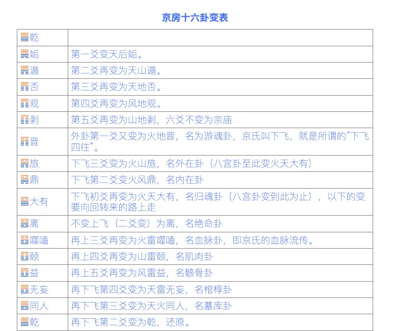
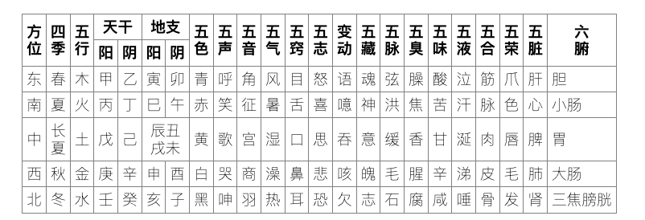

# 易经杂说

## 阅读进度

https://www.quanxue.cn/ct_nanhuaijin/yijing/yijing47.html

[参考]()

## 提到概念

易经数理是归纳，西方是演绎。

### 六十四卦分宫图



### 伏羲六十四卦方圆图



### 伏羲六十四卦次序图


一切都是在不断变易之中，而一切的变易，并非乱动乱变，而是循了一种固定的法则而变的。如何去找到这一固定的法则，还是要靠各人自己智慧的成就；

六爻：事物发展的六个阶段

不三不四：三爻四爻最重要，乱七八糟：游魂卦、归魂卦

画卦是由下往上，由内而外

《易经》的理不必偏重但不是不重视，因为研究几年懂了《易经》以后，大家都会说理。正理只有一条，歪理可有千条。《易经》的象与数，
却是科学的，没有办法讲歪的，就非要学会它的规矩、法则，才能懂得《易经》

有理无事经验未到，有事无理智慧不足，万事万物皆象数理，事理合一真正学问。

掐指一算：数。

《易经》每一卦、每一爻、每一点，都包含有理、象、数三种涵义在内。

象数理通变：每个现象，到了一定的数一定会变，为什么会变，有它的理，完全明白了这些，就万事通达了。理、象、数通了，就能知变、通、达，万事前知了。

一切中国的文化，周文王著作《易经》以后开始发展下来的。所以诸子百家之说，都渊源于这本书。

乾坤代表了：时间、空间、宇宙

爻者，交也：万事万物，时时都在交流，不停地发生关系，引起变化

震卦的对宫卦就是巽卦。

金生丽水：《千字文》:[参考](https://ctext.org/wiki.pl?if=gb&chapter=113246&remap=gb)

晚上不要读《易经》

综卦：倒过来看（反对） 错卦：阴阳变（旁通） 交互卦：345交234互

游魂卦：外卦的初爻变 归魂卦：内卦变成原位

一、本体卦，二、初爻变，三、二爻变，四、三爻变，五、四爻变，六、五爻变，七、四爻变回原爻，八、内卦变回本体卦

```综卦的理，因为立场不同，告诉我们万事要客观，观念就完全两样。【反对】
错卦的理，是立场相同，目标一致，可是看问题的角度不同，所见也就不同了。【正对】
交互的理，这是告诉我们看事情，不要看绝了，不要只看一面，一件事情正面看了，再看反面，反面看了，再把旁边看清楚，同时旁边亦要看反面，这样四面
都注意到了，还不算完备，因为内在还有变化，而内在的变化，又生出一个卦了。
```

学《易经》没有办法不背诵的。

六十四卦可发展到无数的卦，每一卦牵一发而动全身，都是彼此相互的关系。

正、反、合是三段论法，《易经》是八段论法。

相对、正反、交错。

姤卦的综卦是夬卦，错卦是复卦，交互是乾卦。复卦是综卦是剥卦。【八面玲珑】

综卦：绝对的8个，相对的56个。

堪舆学：移形换步

三易：连山，归藏，周易

三易：变易，简易，不易

三内涵：理、象、数【三种研究角度】

乾、坤、离、坎：天地日月

震、巽、艮、兑：雷风山海

```伏羲八卦次序：“乾兑离震巽坎艮坤” 
文王八卦次序：“乾坎艮震巽离坤兑”。
```

阳四宫：乾（天）坎（水）艮（山）震（雷），阴四宫：巽（风）离（火）坤（地）兑（泽）

朱熹的《周易本义》八卦取象歌：乾三连、坤六断、震仰盂、艮覆碗、离中虚、坎中满、兑上缺、巽下断

```巽4  离9  坤2
震3  中5  兑7
艮8  坎1  乾6
```

文王后天卦口诀：一数坎兮二数坤，三震四巽数中分，五寄中宫六乾是，七兑八艮九离门。
伏羲先天卦口诀：乾一兑二离三震四，巽五坎六艮七坤八

先天卦9，后天卦10。用九合十。先天卦体，后天卦用。先天卦根本，后天卦起用。

东方：上南下北左东右西。西方：上北下南左西右东。西方人指北（看北极），东方人指南（看太阳）。东方人在北半球看太阳在南方，南半球看太阳在北方。北半球
房子坐北向南，皇帝南面而王。

滕王阁序：天文地理物理人事都包涵了。豫章故郡，洪都新府。星分翼轸，地接衡庐。

天道左旋，地道右旋。

一动便生吉凶悔吝。

易经文化用来算命是小道文化，不是中华文化。

卦的方位：


乾三连、坤六断、震仰盂、艮覆碗、离中虚、坎中满、兑上缺、巽下断

六爻是人生的六个阶段。

阳卦多阴，阴卦多阳。

宗教迷信就成为人类文化的起源，人类任何文化都是这种宗教迷信──现代称为神秘学为起源。

易学是高深的，欲真的把它变成为有用的，必须如此。没有做到实用，还是抽象化的偏重在思想方面，
换言之只是偏重于哲学方面，是虚玄的，实际无用。

黑格尔的辩证历史观。

释迦牟尼讲学四种方式，其中一种为“置答”。《中阿含经》第60卷 例品箭喻经第十 十四无记

人类世界的历史哲学原则：序卦。

上经的卦序，是讲人类社会与历史发展的关系，下经讲到人生了，下经亦很妙。

人类社会，只有四个字“饮食”、“男女”两件事。

《易经》的原则只能渐变，没有突变的事，那种看来是突变的现象，也是渐渐来的。

人世间事情是永远作不了结论的，永远是未济。

吉凶，对或不对，就是既济或未济。

无论是哪位《易经》大家，乃至于上通天文、下知地理的人，都没一个圆满的解答。

《易经》的难识难懂，由于象数的失传，本来艰涩的词句，幽晦不明的含义，已经造成了后人学《易》极大的文字障碍。

义理之学，象数之学

王弼：得意而忘彖，得彖而忘言

执象数而弃义理，失去了古人作《易》的本旨。

六十四卦方圆两图，圆图是管宇宙的时间,方国管空间代表方位方向。

先天卦的方圆图，后天卦方圆图

重卦：乾、履、同人、无妄、姤、讼、遁、否

刚柔亦是互相变易的，不可看作是固定非如此不可，唯有知道怎样变，才算是知道了《易经》

京房的易变名十六卦变:自初至五不动复，下飞四往伏用飞，上飞下飞复本体，便是十六变卦例。

京房十六卦变表


邵康节

阴阳家驺衍

```五行生克
金，凡是坚固、凝固的都是金，上古时不是现代的科学分类，当时对于物质世界中有坚固性能的，以金字作代表。
木，代表了树木，代表了草，代表了生命中生的功能和根源。草木被砍掉以后，只要留根，第二年又生长起来。
水，代表了流动性，周流不息的作用。
火，代表了热能。
土，代表了地球的本身。
隔代相克，逢三必变，这是一个法则。
生：木生火，火生土，土生金，金生水，水生木.
克：木克土，土克水，水克火，火克金，金克木.
木属肝，火属心，土属脾，金属肺，水属肾
肝木，心火，脾土，肺金，肾水
```

西医物理位置肝脏主要位于人体右侧。
中医说肝生于左，而西医指责错了，其实中医一点没有错，因为中医不是讲物质形态，而是讲气化，中医说肝生于左，是肝属木，木在东方，东方在左，
这是五行生克的气化，所以肝生于左是对的。由此可知人必须读《黄帝内经》，懂了《黄帝内经》就懂得养生之道，也懂得如何修道了。

天干就是五行的法则。

```五行方位图
      南火
东木   中土   金西
      水北 
```

伟大的著作：《千字文》

东方甲乙木，南方丙丁火，西方庚辛金，北方壬癸水，中央戊己土。

甲木为阳木，乙木为阴木，丙为阳火，丁为阴火，庚为阳金，辛为阴金，壬为阳水，癸为阴水，戊为阳土，己为阴土。

自己并没有研究过，还不懂它，就说它是骗人的迷信，这才是真正的迷信——迷信自己的狂妄。

金生水，肺出了问题的时候，肾一定亏，所以生肺病的人，脸红红的，而是肾水不足，火气上升。肺病到了相当严重，肾盂就特别扩大，就是肾亏。

西医：头痛医头，脚痛医脚
中医：病在上者治其在下，病在下者治其在上，病在左者治其在右，病在右者治其在左，病在内者治其在外，病在外者治其在内。

中国古代的医学有两大派，在养生之道上，南方一派注重肠胃，北方一派注重肾。

天干十个：甲、乙、丙、丁、戊、己、庚、辛、壬、癸
地支十二个：子、丑、寅、卯、辰、巳、午、未、申、酉、戌、亥。
二生肖：子鼠、丑牛、寅虎、卯兔、辰龙、已蛇、午马、未羊、申猴、酉鸡、戌狗、亥猪



京焦易：京房和焦赣

阳卦多阴：天风姤卦——就是以阴爻为主

因为本身无事，一动便有吉、凶、悔、吝。

三个铜钱卜卦：动爻上看吉凶。

随便报三个数字：1，2，3 一为乾，二为兑，天泽履，第三爻为动爻。

有疑则卜，无疑则不卜。

## 提到书文

《礼记·经解》：洁静精微，《易》教也。《易》之失，贼。 [参考](https://ctext.org/liji/jing-jie/zhs)

《古今图书集成·干支部》所：“以二十八宿之天禽、地曜，分直于天，以纪十二辰，此十二生肖之所始”

《京房易》[参考](https://www.eee-learning.com/article/5685)

《焦氏易林》焦赣

《京房易传》

《易经集注》

《针灸甲乙经》

《洗冤录》

## 提到诗词

## 提到历史

虞世南：不读《易》不可为将相。

## 个人扩展

分宫卦象次序

### 六十四卦卦序歌

分宫卦象次序

分宫卦象次序歌

```乾宫：乾为天，天风姤，天山遁，天地否，风地观，山地剥，火地晋，火天大有。
坎宫：坎为水，水泽节，水雷屯，水火既济，泽火革，雷火丰，地火明夷，地水师。
艮宫：艮为山，山火贲，山天大畜，山泽损，火泽睽，天泽履，风泽中孚，风山渐。
震宫：震为雷，雷地豫，雷水解，雷风恒，地风升，水风井，泽风大过，泽雷随。
巽宫：巽为风，风天小畜，风火家人，风雷益，天雷无妄，火雷噬嗑，山雷颐，山风蛊。
离宫：离为火，火山旅，火风鼎，火水未济，山水蒙，风水涣，天水讼，天火同人。
坤宫：坤为地，地雷复，地泽临，地天泰，雷天大壮，泽天夬，水天需，水地比。
兑宫：兑为泽，泽水困，泽地萃，泽山咸，水山蹇，地山谦，雷山小过，雷泽归妹。
```

上下经卦名次序歌

```乾坤屯蒙需讼师， 比小畜兮履泰否，
同人大有谦豫随， 蛊临观兮噬嗑贲，
剥复无妄大畜颐， 大过坎离三十备。
咸恒遁兮及大壮， 晋与明夷家人睽，
蹇解损益夬姤萃， 升困井革鼎震继，
艮渐归妹丰旅巽， 兑涣节兮中孚至，
小过既济兼未济， 是为下经三十四。
```

上下经卦变歌

```讼自遁变泰归妹，否从渐来随三位。
首困噬嗑未济兼，蛊三变贲井既济。
噬嗑六五本益生，贲原于损既济会。
无妄讼来大畜需，咸旅恒丰皆疑似。
晋从观更睽有三，离与中孚家人系。
蹇利西南小过来，解升二卦相为赘。
鼎由巽变渐涣旅，涣自渐来终于是。
```


