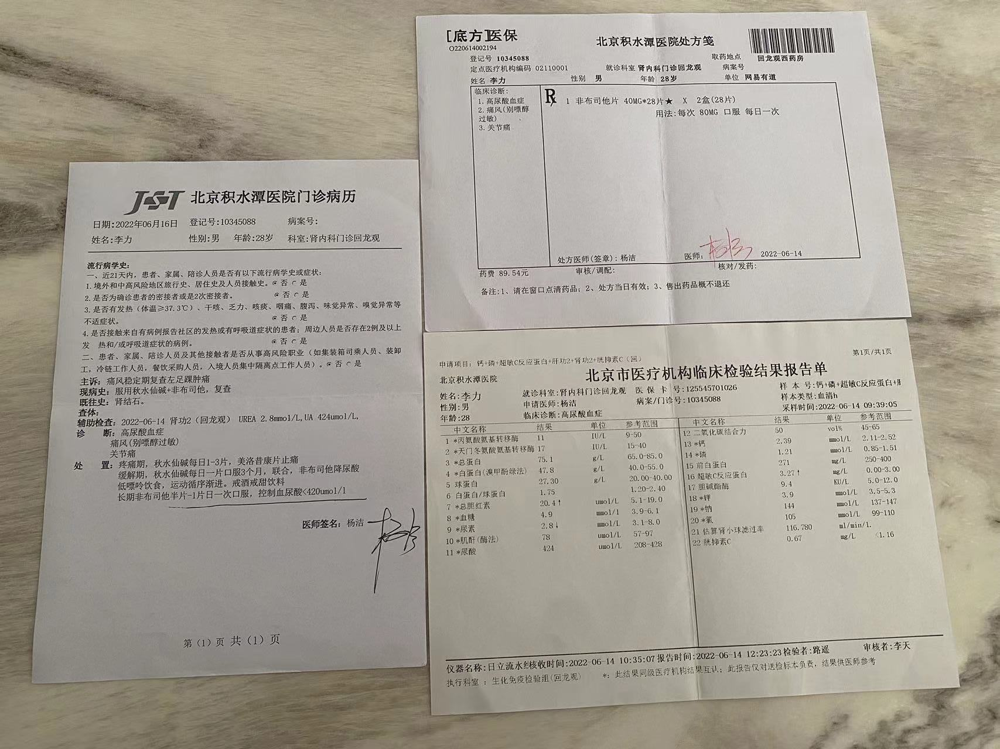
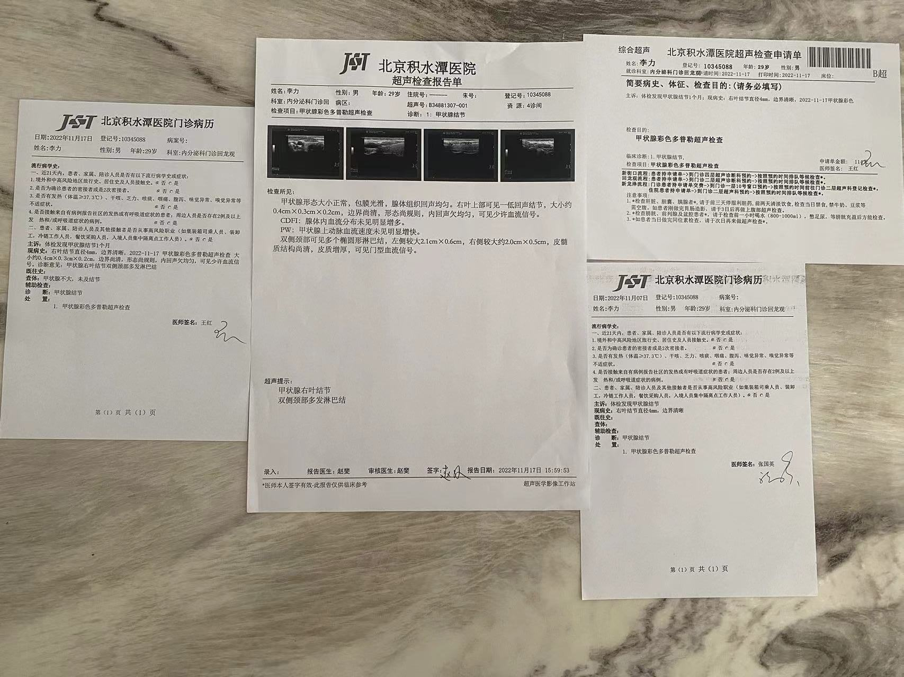
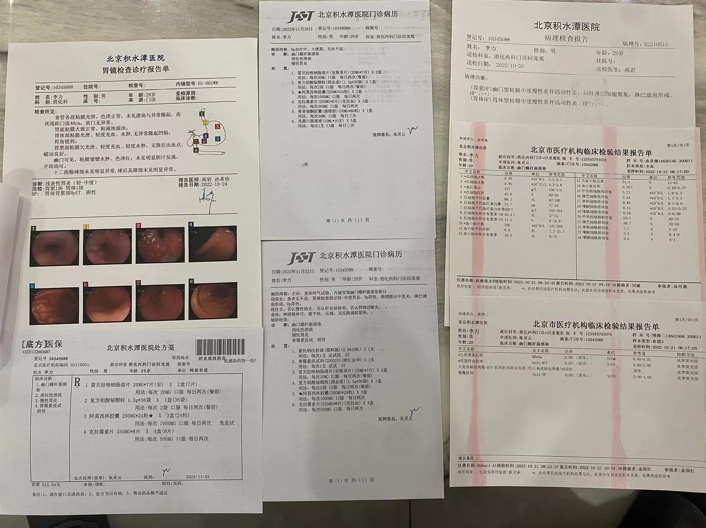
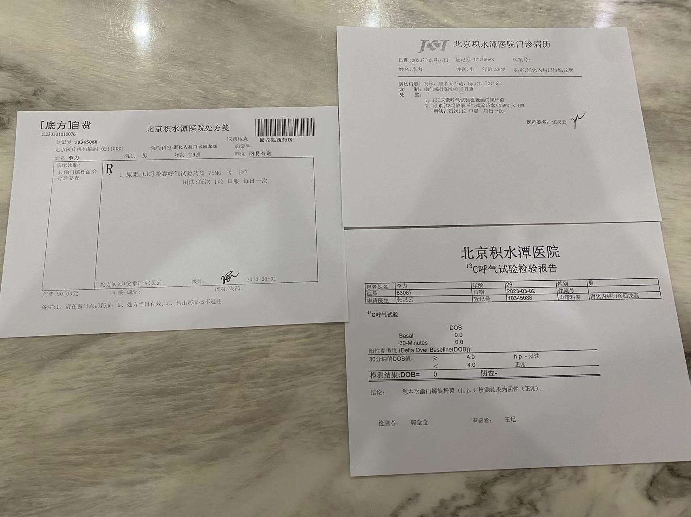

# 病历报告

## 2022-05-09 北京积水潭医院

肾内科：痛风，肾结石

## 2022-05-15 北京积水潭医院

泌尿外科：肾结石

## 2022-06-16 北京积水潭医院

肾内科：痛风复查

## 2022-08-09 北京积水潭医院

肾内科：痛风，肾结石复查

## 2022-11-07 北京积水潭医院

肾内科：痛风，肾结石复查

## 2022-11-17 北京积水潭医院

内分泌科：甲状腺结节

## 2022-11-29 北京积水潭医院

消化内科：幽门杆菌阳性，浅表性胃炎

## 2023-03-01

消化内科：幽门杆菌复查阴性，恢复正常

## 2023-03-03

眼科：近视，斜视

