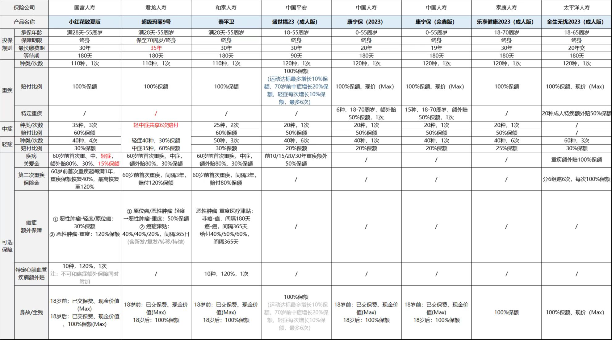
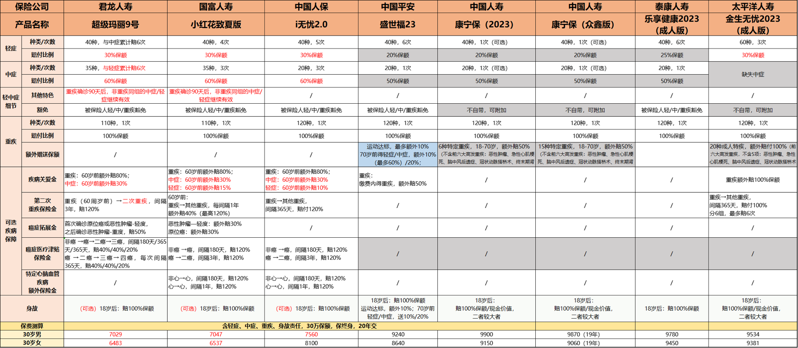

# 保险

## 选择逻辑

价格

保障

组合（单产品组合，多产品组合），50w产品组合两个25w的。

交费：时间杠杆类（短），风险杠杆类（长）

保险产品的价格取决于预定利率，赔付成本，发生概率，锁定长短风险，免赔额，产品条款等因素。

## 保险合同查看

保障责任，责任终止

## 参考

测评72款定期寿险：https://mp.weixin.qq.com/s/CJL7DKMqs5QKeovK56Ohxw

成年人保险配置指南（2023最新版）https://mp.weixin.qq.com/s/YzahEsBJssWPCZLRe6GeLQ

小雨伞：https://www.xiaoyusan.com/

深蓝保：https://www.shenlanbao.com/

惠择：https://www.huize.com/

友邦保险：https://www.aia.com.cn/zh-cn/index

西瓜视频，bilibili

## 产品选择

### 购买逻辑

定寿：等待期，保障内容（必须包含身故+全残），免责条款，健康告知，价格。

重疾险：健康告知，疾病数量，轻中症保障，等待期。

医疗险：保障内容，续保条件，免赔额。

意外险：保障责任（必须包含意外身故，医疗，意外伤残），意外医疗报销门槛，是否包含猝死，职业限制，年龄限制。

小孩：意外，医疗，教育储蓄

成人：意外，重疾，人寿，医疗

老人：意外，医疗，储蓄

家庭投保6大原则：1 先保障后理财 2 先人身后财产 3 先大人后小孩 4 先保额后保费 5 先规划后产品 6 先拥有后丰富

购买保险6大原则：1 保障第一理财第二 2 先大人后小孩 3 满足保额比节约保费更重要 4 考虑整体保险规划 5 先人身后财产 6 明确保险责任

### 成人

优先锁定长期风险（定期寿险，长期重疾），然后短期的医疗险，意外险。

选择难度：重疾>医疗>寿险>意外

价格：重疾>寿险>医疗>意外（因为重疾和寿险都是长期的，医疗和意外是短期的）

需要续保：医疗，意外 不需要续保：重疾，寿险

核保严格：医疗>重疾>寿险>意外

长期险：寿险，重疾 短期险：医疗，意外。保证续保的医疗险也是长期险，锁定长期风险。

保险优于理财。

百万医疗便宜因为一万块免赔+赔付成本不确定。

重疾：一般都是70或终身的。

## 公司选择

国富人寿

同方全球

华贵人寿

## 重疾

推荐产品：达尔文7号、超级玛丽9号

### 产品2023

### 价格2023

## 医疗

推荐产品：好医保20年长期医疗（支付宝独家）也有6年的、医享无忧20年长期医疗。好医保6年长期医疗。

金医保，蓝医保，好医保，长相安（对比视频： https://www.bilibili.com/video/BV1mN411D7RH ）。

好医保的坑：健康告知。支付宝自己投保的坑，告知不全面。没有代理人进行健康状况检查，理赔比较麻烦。

## 意外

推荐产品：小蜜蜂3号，大护甲5号，水滴巡洋舰

## 定寿

推荐产品：华贵大麦，臻爱2023，定海柱3号、擎天柱7号。

## 我的想法

医疗险（好医保长期医疗险（6年版）-人保健康）

意外险（小蜜蜂3号（太平洋财险），大护甲5号（人保财险），大护甲家庭版（太平洋财险））

定期寿险（华贵大麦家（华贵人寿），同方臻爱2023（同方全球））

重疾险（达尔文7号（停售-国联人寿）、超级玛丽9号（君龙人寿）、小红花致夏版（停售-之前叫达尔文6号-国富人寿，称为达尔文8号））、泰平卫（和泰人寿）

## 购买渠道

惠择，小雨伞，官方公众号，深蓝保。基本上都能买到互联网产品。

好医保：支付宝

金医保：小雨伞，深蓝保

小蜜蜂3号：惠择，深蓝保

大护甲5号：小雨伞，深蓝保

华贵大麦家：官房小程序，小雨伞，深蓝保

同方臻爱2023：官房小程序，小雨伞，深蓝保，支付宝

超级玛丽9号：小雨伞，深蓝保

## 产品评测

### 小蜜蜂3号

百万意外。

意外险 突破150w。4个版本。买最高额度的。T+3生效。

就医带好社保卡。

### 小红花致夏版

赔完重症，中轻还继续在。

终身产品。

### 华贵大麦旗舰版

责任简单，杠杆高。

市场标杆产品。

定期寿险半壁江山。

麦芽糖2023。

免责3条，很少。

对比臻爱2023：https://www.shenlanbao.com/vs?ids=1132991161767178240-1118553230005501952

### 超级玛丽9号

70岁或终身。

正确的附加险形态。

附加险如何选择？

第二次重大疾病保险金。理赔严格，几乎不可能赔到。

疾病关爱保险金：贵

恶性肿瘤——重度医疗津贴保险金：核心优势。

恶性肿瘤——重度拓展保险金：不建议附加。

### 同方臻爱2023

发病24小时内死亡，如何证明开始时间呢？睡梦中呢？所以寿险对死亡保障更全。

投保完成是服务的开始。