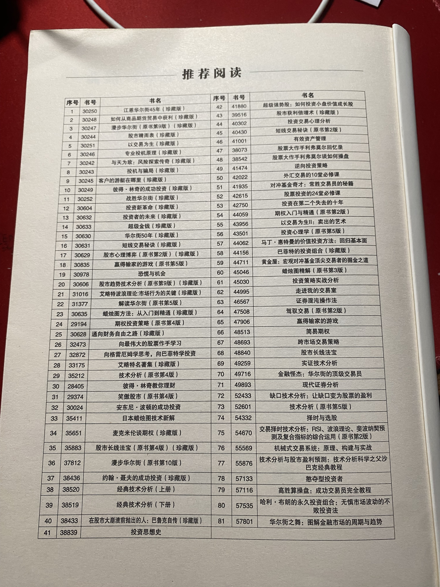

# 华章金融书

## 华章书籍列表

- 1-江恩华尔街45年 珍藏版
- 2-如何从商品期货交易中获利 珍藏版
- 3-漫步华尔街 原书第9版
- 4-股市晴雨表 珍藏版
- 5-以交易为生 珍藏版
- 6-专业投机原理 珍藏版
- 7-与天为敌 风险探索传奇 珍藏版
- 8-投机与骗局 珍藏版
- 9-客户的游艇在哪里 珍藏版
- 10-彼得·林奇的成功投资 珍藏版
- 11-战胜华尔街 珍藏版
- 12-投资新革命 珍藏版
- 13-投资者的未来 珍藏版
- 14-超级金钱 珍藏版
- 15-华尔街50年 珍藏版
- 16-短线交易秘诀 珍藏版
- 17-股市心理博弈 珍藏版
- 18-赢得输家的游戏 精英投资者如何击败市场 原书第6版
- 19-恐慌与机会 如何把握股市动荡中的风险和机遇 原书第2版
- 20-股市趋势技术分析 原书第9版 珍藏版
- 21-艾略特波浪理论 市场行为的关键 珍藏版
- 22-解读华尔街 原书第5版
- 23-蜡烛图方法 从入门道精通 珍藏版
- 24-期权投资策略 原书第4版
- 25-通向财务自由之路 珍藏版
- 26-向最伟大的股票作手学习
- 27-向格雷厄姆学思考，向巴菲特学投资
- 28-艾略特名著集 珍藏版
- 29-技术分析 原书第5版
- 30-彼得·林奇教你理财
- 31-笑傲股市 趋势选股大师最有用的买入卖出规则 原书第4版
- 32-安东尼·波顿的成功投资
- 33-日本蜡烛图技术新解
- 34-麦克米伦谈期权 原书第2版 珍藏版
- 35-股市长线法宝 原书第4版 珍藏版
- 36-漫步华尔街 原书第10版
- 37-约翰·聂夫的成功投资 珍藏版
- 38-经典技术分析 上 原书第2版
- 39-经典技术分析 下 原书第2版
- 40-在股市大崩溃前抛出的人 巴鲁克自传 珍藏版
- 41-投资思想史 珍藏版
- 42-超级强势股 如何投资小盘价值成长股 珍藏版
- 43-股市获利倍增术 十步法建立跑赢市场的股票投资组合 珍藏版
- 44-投资交易心理分析
- 45-短线交易秘诀 原书第2版
- 46-有效资产管理 最著名的资产配置科普书
- 47-股票大作手回忆录 珍藏版
- 48-股票大作手利弗莫尔谈如何操盘
- 49-逆向投资策略 原书第4版
- 50-外汇交易的10堂必修课
- 51-对冲基金奇才
- 52-股票投资的24堂必修课
- 53-投资在第二个失去的十年
- 54-期权入门与精通
- 55-以交易为生2：卖出的艺术
- 56-投资心理学 第5版
- 57-马丁·惠特曼的价值投资方法 回归基本面
- 58-巴菲特的投资组合 珍藏版
- 59-黄金屋：宏观对冲基金顶尖交易者的掘金之道
- 60-蜡烛图精解 股票和期货交易的永恒技术 原书第3版
- 61-投资策略实战分析 下 华尔街股市经典策略20年推演 原书第4版
- 62-走进我的交易室 最佳交易实践指南
- 63-证券混沌操作法：股票、期货及外汇交易的低风险获利指南
- 64-驾驭交易 原书第2版
- 65-赢得输家的游戏 精英投资者如何击败市场 原书第6版
- 66-简易期权 原书第3版
- 67-跨市场交易策略
- 68-股市长线法宝 原书第5版
- 69-实证技术分析 用科学量化方法锁定交易信号
- 70-金融怪杰：华尔街的顶级交易员 典藏版
- 71-现代证券分析
- 72-缺口技术分析 让缺口变为股票的盈利
- 73-技术分析 原书第5版
- 74-择时与选股
- 75-交易择时技术分析 RSI、波浪理论、斐波纳契预测及复合指标的综合运用
- 76-机械式交易系统 原理、构建与实战
- 77-技术分析与股市盈利预测 技术分析科学之父沙巴克经典教程
- 78-憨夺型投资者 低风险高收益的投资模式
- 79-高胜算操盘 成功交易员安全教程
- 80-哈利·布朗的永久投资组合：无惧市场波动的不败投资法
- 81-华尔街之舞 图解金融市场的周期与趋势

## 华章金融投资

## 下载地址

百度网盘地址：https://pan.baidu.com/s/1PADbs9RYW0sB90rTDbuC7w

提取码：yypi