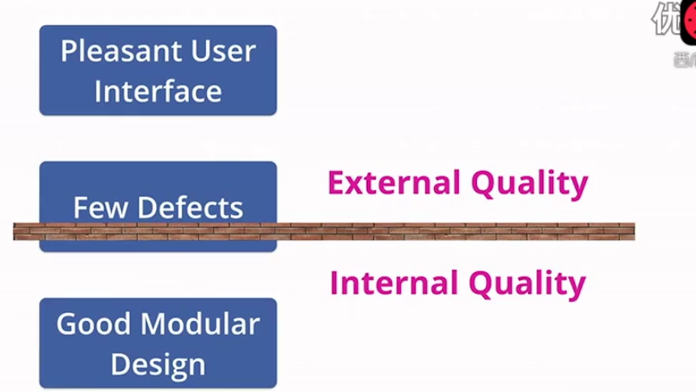
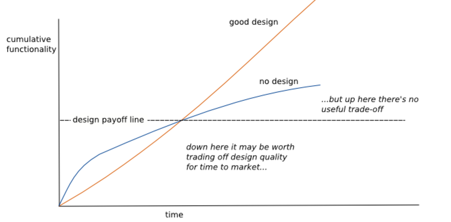

# 第一章

* 1 面向过程：程序 = 数据结构+算法

  面向对象：程序 = 对象+消息

  面向模式：程序 = 模式+ 反模式

  面向业务：程序 = 重构 + 粘贴复制\(业务数据+业务逻辑\)

  业务=数据+逻辑
  
  系统设计=服务+数据存储

* 面向all：程序 = 数据 + 逻辑

---

* 2 架构 = 组件 + 组件间的关系

---

* 3 martin flower：架构是项目组员对软件的共同的理解。什么是系统关键？什么是代码库重要的东西？什么是工作中经常记住的东西？

---

* 4 martin flower： important stuff = shared understanding + hard to change

---

* 5 martin flower：我们做好工作通常基于道德上的原因，但是手艺人和经济人之间的战争，经济总会获胜。质量和成本间的折0中。

---

* 6 martin flower：软件质量 = 内部质量 + 外部质量。 内部质量通常理解为好的模块设计，外部设计是好的用户体验。



---

* 7 martin flower： 如果我们不在软件内在质量付诸努力，最终我们就是欺骗客户，我们在放慢客户竞争的能力。

---

* 8 martin flower：好的设计和坏的设计会有一个临界点。前期坏的设计累加功能快，而后期好的设计的市场价值才会显现出来。



---

* 9 martin flower： 持续集成，持续交付，快速响应变化。新时代软件信条。

---

* 10 GOF23设计模式口诀： 两个慈母在阿里云上看电视，唱着abcdffp，结果ab型号的电视fps变快了。 

`行为：CCIIMMOSSTV   结构：ABCDFFP  创建：ABFPS`

---

* 11 抱怨CRUD和IF-ELSE没技术含量是因为掌握的模式太少，这和初级还是高级开发并没有必然联系。

---

* 12 招式：Java,SSH,Eclipse,JSP,ASP,.Net等框架技术。

  内功：数据结构,算法,重构,软件工程,设计模式等。

---

* 13 重构：在不改变软件可观察行为前提下改善其内部结构。

---

* 14 重构是在代码写好后改进它的设计。设计-》编码-》设计-》编码......

---

* 15 什么是技术沉淀？沉淀知识？沉淀经验？沉淀工龄？看xx源码？看底层原理？都不是，沉淀的是方法论和软件观。但是前提是看xx源码，看xx原理。

---

* 16 算法：空间和时间的平衡艺术。算法代价的数学表述：常数-一次-二次-指数-幂数。
  GC算法也是如此。

---

* 17 Java，JS书籍对比。《Java编程思想》-《JS权威指南》   《Efftive Java》-《JS语言精粹》  《Java核心技术》-《Js高级程序设计》

---

* 18 业务代码：时间和质量呈现不相关关系。写“坏味道”代码依旧“坏味道”，写“优雅代码”依旧“优雅”。时间短就写不出好代码是多么的愚蠢逻辑！

---

* 19 技术再深，无非就是源码，但是源码的背后是什么？

---

* 20 面向对象四大特征：封装，继承，多态，抽象。而继承和封装是矛盾的，所以才有了委派\[delegate\]。

---

* 21 做不到共享的CodeReview不是好的CodeReview。

---

* 22 孙玄：一切抛开业务的架构设计都是耍流氓 。

---

* 23 架构选择：All in One 还是 One in One\[SOA,MicroService, distributed\]，对于创业初期，All in One更加普遍。

---

* 24 阅读源码：一次精神洗礼之旅。

---

* 25 技术和业务影响团队的组织结构。

---

* 26 设计模式：总是将变化的事物和不变的事物分离开。

---

* 27 设计模式： 可复用面向对象软件的基础。

---

* 28 编程的一种方法论：Talk is cheap，Show me the code。

---

* 29 《人件》更像本管理指南，而不是本管理书。

---

* 30 康威定律：设计系统的组织，最终会将其沟通结构复制到产品的设计中。

---

* 31 没有银弹也是银弹。

---

* 32 写代码如同写诗，灵感来源于大量的积累。

---

* 33 必须将技术提升和学习作为日常生活之战略。如同吃饭喝水一样平常。

---

* **34 十个字**以内描述GOF模式：
* A抽象工厂：产品族的创建。
* B构建者：复杂对象创建与组装
* F工厂方法：多态工厂
* P原型：对象克隆
* S单例：确保对象唯一性
* 简单工厂：集中工厂 \[静态工厂\]
* A适配器：不兼容结构协调
* B桥接：处理多维变化
* C组合：树形结构处理
* D装饰：扩展系统功能
* F外观：提供统一入口
* F享元：实现对象复用
* P代理：对象间接访问
* C职责链：请求链式处理
* C命令：请求发送者和接受者解耦
* I解释器：自定义语言
* I迭代器：遍历聚合对象元素
* M中介者：协调多对象交互
* M备忘录：撤销功能的实现
* O观察者：对象联动
* S状态：对象状态转换
* S策略：算法封装与切换
* T模板方法：定义算法框架
* V访问者：操作复杂对象结构

---

* 35 软件变化是必然的，有变化就要维护，随着时间的推移，维护成本远远大于初期的开发成本，因此，在软件开发中，最重要的是降低维护成本，维护成本正比于系统复杂度，所以降低维护成本，系统设计就要追求简单清晰。

---

* 36 软件质量取决于：机器质量+想法质量+代码质量+沟通质量

---

* 37 程序是什么？对于程序员是机器指令，对于用户是用户指令。

---

* 38 某种程度上技术的瓶颈可能取决于业务的瓶颈。

---

* 39 软件的目的是帮助他人。

---

* 40 软件设计方程式：D = Vn+Vf \/ Ei + Em

  ```
   D:变化可行性  Vn:当前价值 Vf:未来价值  Ei:开发成本 Em:维护成本 
   随着时间推移方程转化为：D = Vf / Em    结论：相比于降低开发成本，降低维护成本更重要。
  ```

---

* 41 变化定律：程序存在时间越长,他的某个部分变化可能性越大。

---

* 42 缺陷定律：程序中新增缺陷可能性与代码修改量成正比

---

* 43 简洁定律：软件某部分的维护难度，反比于该部分的简洁程度。

---

* 44 测试定律：你对软件行为了解程序，等于你真正测试他的程度。

---

* 45 相比降低开发成本，降低维护成本更重要。而维护成本正比于系统复杂性。

---

* 46 Rod Johnson ：市面J2EE作品过分强调各种J2EE规范，而忽视规范所解决现实问题。

---

* 47 “多瘤程序员”：已经掌握一项技术的实际使用技巧但同时留下了许多疤痕。

---

* 48 Rod Johnson：设计一次，在任何地方重新实现几个接口。而不是设计一次到处运行。

---

* 49 Rod Johnson谈优质代码。

---

* 50 OO设计比任何一项特定的实现技术（比如J2EE，Java）都重要。好的编程习惯和健全的OO设计使得J2EE应用具有坚实基础。劣质的Java代码就是劣质的J2EE代码。

---

* 51 OO原理加强J2EE开发。

---

* 52 许多开发花太多时间应付API，却花太少时间坚持好的编程习惯。

---

* 53 J2EE必读书目：《poeaa》，《expert one-to-one J2EE Design and Development》，《core J2EE patterns》，《expert one-to-one J2EE development without ejb》

---

* 54 技术提升两条路：1  广   2   深     在某个时间点他们会汇合起来。深会追求广，广会反哺深。

---

* 55 对知识（包括编程）产生崇敬感：先让其知道学问之大，进而产生渺小感，遂而从渺小感生出崇敬感。培养人才要从此入手。
  今夫天，斯昭昭之多，及其无穷也，日月星辰系焉，万物覆焉。今夫地，一撮土之多。及其广厚，载华岳而不重，振河海而不泄，万物载焉。

---

* 56 异常的定义：我对此感到意外。

---

* 57 代码量的定义：1 不重复代码。 2 上线的代码。

---

* 58 好的程序设计语言能够帮助程序员写出好的程序，但是无论哪种语言，都阻止不了程序员用它写出坏程序。

---

* 59 无限接近自己所在领域的大师境界。

---

* 60 毕业五年内看完Spring源码和Netty源码。

---

* 61 重要的不是你学到什么，而是感受到什么。没有感受是白痴，感受比别人强是下道，感觉比自己强是中道，感觉和大师相通是大道。很多人止于超越自我。而兴趣或许可以加速这一切发生。

---

* 62 一定要有专门时间段学习软件业大师的非技术书。 比如温伯格, Kent Beck,Frederic Brooks\(人月神话\)

---

* 63 行业对比：投资框架和编程框架。

---

* 64 Cache和Pool都是资源管理方式，区别在于有无资源标识符。因为有了标识符，缓存持久化才有了意义。

---

* 65 类间关系：关联，依赖，泛化（继承），实现。

---

* 66 源码UML类图口诀：一进二出三关联  四多五少六抽象。

---

* 67  Java数组的协变的，无通配符的泛型是非协变的，有通配符的泛型是协变的。

---

* 68 你的水平就是团队的水平，提升团队水平先提升自我。

---

* 69 每天几条effective java，就是力量。

---

* 70 POSA：

---

* 71 POSA2:Patterns for Concurrent and Nerwork Objects

**服务访问和配置模式：**包装器外观\[Wrapper Facade\]，组件配置器\[Component Configurator\]，拦截器\[Interceptor\]，扩展接口\[Extension Interface\]

**事件处理模式：**反应器\[Reactor\]，主动器\[Proactor\]，异步完成标记\[Asynchronous Completion Token\]，接受器-连接器\[Acceptor-Connector\]

**同步模式：**定界加锁\[Scoped Locking\]，策略加锁\[Strategized Locking\]，线程安全接口\[Thread-Safe Interface\]，双重加锁优化\[Double-Checked Locking Optimization\]

**并发模式：**主动对象\[Active Object\]，监视器对象\[Monitor Object\]，半同步半异步\[Half-Sync\/Half-Async\]，领导者追随者\[Leader\/Flowers\]，线程特定存储\[Thread-Specific Storage\]

---

* 72 POSA3: Patterns for Resource Management

**资源获取：**查找模式\[Lookup\]，延迟获取\[Lazy Acquisition\]，预先获取\[Eager Acquisition\]，部分获取\[Partial  Acquisition \]

**资源生命周期：**缓存\[Caching\]，池\[Pooling\]，协调者\[Coordinator\]，资源生命周期管理器\[Resource Lifecycle Manage\]

**资源释放：**租约\[Leasing\]，驱逐者\[Evitor\]

---

* 73 POSA4:A Pattern Language for Distributed Computing  114个模式

**从混沌到结构：**Domain Model\[领域模式\] ，Layer\[分层\]， Model-View-Controller\[模式-视图-控制器\]，Presentation-Abstraction-Controller\[表现-抽象-控制\]，Microkernel\[微内核\]，Reflection\[反射\]，Pipes And Filters\[管道和过滤器\]，Shared Respository\[共享仓库\]，Blackboard\[黑板报\]，Domain Object\[领域对象\]

**分布式基础设施：**Messaging\[消息传递\] 【 Message Channel\[信道\],Message Endpoint\[消息端点\],Message Translator\[消息转换器\],Message Router\[消息路由\] 】 ,Pub-Sub\[发布者-订阅者\],Broker\[经纪人\],【Client Proxy\[客户端代码\],Requestor\[请求者\],Invoker\[调用者\],Client Request Handler\[客户端请求处理\],Server Request Handler\[服务端请求处理\]】

**事件分离和分发：**Reactor\[反应器\],Proactor\[前摄器\],Acceptor-Connector\[接受器-连接器\],Asynchronous Completion Token\[异步完成令牌\]

**接口划分：**Explicit Interface\[显示接口\],Extension Interface\[扩展接口\],Introspective Interface\[内省接口\],Dynamic Invocation  Interface\[动态调用接口\],Proxy\[代理\],Bussiness Delegate\[业务委派\],Facade \[外观\],Combined Method\[组合方法\], Iterator \[迭代器\],Enumeration Method\[枚举方法\],Batch Method\[批处理方法\]

**组件划分：**Encapsulated Implementation\[封装实现\],Whole-Part\[整体-部分\],Composite\[组合\],Master-Slave\[主-从\],Half-Object plus Protocol\[半对象加协议\],Replicated Component Group\[复制组件组\]

**应用控制：**Page Controller\[页面控制器\],Front  Controller \[前端控制器\],Application  Controller \[应用控制器\],Command Processor\[命令处理程序\],Template View\[模板视图\],Transform View\[转换视图\], Firewall Proxy\[防火墙代理\],Authrization\[授权\]

**并发：**Half-Sync\/Half-Async\[半同步-半异步\],Leader-Followers\[领导者-追随者\],Active Object\[活动对象\],Monitor Object\[监控对象\]

**同步：**Grarded Suspension\[守护挂起\],Future\[未来\/期货\],Thread-Safe Interface\[线程安全接口\],Double-Checked Locking\[双重锁检测\],Stategized Locking\[策略锁\],Scoped Locking\[区域锁\],Thread-Special Storage\[线程专属存储\],Copied Value\[副本值\],Immutable Value\[不变模式\]

**对象间交互：**Observer\[观察者\],Double Dispatch\[双分派\],Mediator\[中介者\],Command\[命令\],Memonto\[备忘录\],Context Object\[上下文对象\],Data Transfer Object\[数据传输对象\],Message\[消息\]

**适配和扩展：**Bridge\[桥接\],Object Adapter\[对象适配\],Chain of Responsibility\[职责链\],Interpreter\[解释器\],Interceptor\[拦截器\],Visitor\[访问者\],Decorator\[装饰者\],Execute-Around Object\[环绕执行对象\],Template Method\[模板方法\],Strategy\[策略\],Null Object\[空对象\],Wrapper Facade\[包装外观\],Declarative Component Configuration\[声明组件配置\]

**模态行为：**Objects for States\[状态对象\],Method for States\[状态方法\],Collections for States\[状态集合\]

**资源管理：**Container\[容器\],Component Configurator\[组件配置\],Object Manager\[对象管理器\],Lookup\[查找\],Virtual Proxy\[虚代理\],Lifecycle CallBack\[生命周期回调\],Task Coordinator\[任务协调者\],Resourse Pool\[资源池\],Resourse Cache\[资源缓存\], Lazy Acquisition \[延迟获取\/懒加载\],Eager Acquisition\[提前获取\],Partial Acqusition\[局部获取\],Activator\[激励器\],Evictor\[驱逐器\],Leasing\[租借\],Automated Garbage\[自动回收\],Counting Handles\[计数句柄\],Abstract Factory\[抽象工厂\],Builder\[构建者\],Factory Method\[工厂方法\],Disposal Method\[销毁方法\]

**数据库访问：**Database Access Layer\[数据库访问层\],Data Mapper\[数据映射器\],Row Data Gateway\[行数据网关\],Table Data Gateway\[表数据网关\],Active Record\[活动记录\]

---

* 74 如果不为业务，不为功利，不为职业，什么都不为，你要学的东西是什么？学的技术是什么？别着急给答案，仔细思考。

---

* 75 Poeaa:

**领域逻辑模式：** Transaction Script\[事务脚本\],Domain Model\[领域模式\],Table Moudle\[表模块\],Service Layer\[服务层\]

**数据源架构模式：** Table Data GateWay\[表数据入口\],Row Data GateWay\[行数据入口\],Active Record\[活动记录\],Data Mapper\[数据映射器\]

**对象-关系行为模式：**Unit of Work\[工作单元\],Identity Map\[标识映射\],Lazy Load\[延迟加载\]

**对象-关系结构模式：**Indentity Field\[标识域\],Foreign Key Mapping\[外键映射\],Association Table Mapping\[关联表映射\],Dependent Mapping\[依赖映射\],Embedded Value\[嵌入值\],Serialized LOB\[序列化LOB\],Single Table Inheritance\[单表继承\],Class Table Inheritance\[类表继承\],Concrete Table Inheritance\[具体表继承\],Inheritance Mappers\[继承映射器\]

**对象-关系元数据映射模式：**Metadata Mapping\[元数据映射\],Query Object\[查询对象\],Repository\[资源\],

**Web表现层模式：**Model-View-Controller\[模型-视图-控制器\],Page Controller\[页面控制器\],Front Controller\[前端控制器\],Template View\[模板视图\],Transform View\[转换视图\],Two-Step View\[两步视图\],Application Controller\[应用控制器\]

**分布模式：**Remote Facade\[远程外观\],Data Transfer Object\[数据传输对象\]

**离线并发模式：**Optimistic Offline Lock\[乐观离线锁\],Pessimistic Offline Lock\[悲观离线锁\],Coarse Grained Lock\[粗粒度锁\],Implicit Lock\[隐含锁\]

**会话状态模式：**Client Session State\[客户端会话状态\],Server Session State\[服务器会话状态\],Database Session State\[数据库会话状态\]

**基本模式：**GateWay\[入口\],Mapper\[映射器\],Layer Supertype\[层超类型\],Separated Interface\[分离接口\],Registry\[注册表\],Value Object\[值对象\],Money\[货币\],Special Case\[特殊情况\],Plugin\[插件\],Service Stub\[服务桩\],Record Set\[记录集\]

---

* 76 Core J2EE Patterns:

**表现层：**Intercepting Filter \[拦截过滤器\],Context Object \[上下文对象\],Front Controller\[前端控制器\],Application Controller\[应用控制器\],View Helper\[视图助手\],Composite View\[复合视图\],Dispatcher View\[分配器视图\],Service To Worker\[服务到工作者\]

**业务层：**Business Delegate\[业务代表\],Service Locator\[服务定位器\],Session Facade\[会话门面\],Application Service\[应用服务\],Business Objec\[业务对象\],Composite Entity\[复合实体\],Transfer Object\[传输对象\],T O Assembler\[传输对象包装器\],Value List Handler\[值列表处理器\]

**集成层：**Data Access Object\[数据访问对象\],Service Activator\[服务激活器\],Domain Store\[业务领域存储\],Web Service Broker\[Web Service中转\]

---

* 77 百度能带来短期快感，但是解决不了长期满足感。

---

* 78 学技术本质是学一个解决方案。解决方案是方法，方法背后是模式，学技术其实就是学模式。

---

* 79 企业应用架构模式讲的是架构还是模式，还是认为架构是一种模式？

---

* 80 对于生命来说，每一天都是一样的，并不存在周六周日，做技术也是如此。

---

* 81 Hibernate是解决方案，数据源架构模式是本质，要分清技术方案和模式区别。

---

* 82 现象学高手不代表就是数理高手。所以对于开发，技术原理不是必须的。单独寻求原理的百度党，还是现象学的产物。问题：你是怎么掌握技术原理的？区分掌握原理是否有用在于对方停留现象还是数理层面------伪原理开发。

---

* 83 形容一下你掌握的技术知识？我会xxx，还是思维导图。还是什么？

---

* 84 以技术理解技术就好比拿着一个榔头看所有东西都是钉子一样。 

---

* 85 “格物致知”同样适用于技术。求的就是个豁然贯通，身性通明。

---

* 86 思维导图关键看出发点，而非知识点的累积。

---

* 87 做技术心不要太满，满了就只能看见自己了。

---

* 88 十个类一天，二十个类三天，三十个类一周。这是正常源码速度。

---

* 89 源码：代码复杂程度随着类的增加而成呈现指数增长关系。

---

* 90 源码分析：抽象层/实现层/工具层/模式层/测试层/异常层/入口类。

---

* 91 面向对象设计原则：SOLID，DRY，YAGNI，GRASP，KISS。

---

* 92 软件开发方法论：

> [https://en.wikipedia.org/wiki/Software\_development\_process](https://en.wikipedia.org/wiki/Software_development_process)

---

* 93 有其一套完整的哲学体系的技术大师，或者技术体系的书最具价值。当然他的作品也是他的代码。可否像投资大师分类方法去划分？分门别派。

---

* 94 人和技术关系思考：成天和老婆在一起，就能领悟男女之道吗？

---

* 95 业内对技术人员需要掌握的知识并没有达成共识。数据结构，操作系统向来叫好不叫座。同时是重要不紧急的知识。

---

* 96 面试一定要问：1 你觉得软件开发需要掌握哪些知识？\[他觉得的往往是他会的和他的视野\]，  2 你未来要学习哪些知识？

---

* 97 当你提出技术有什么意义，目的的时候，是你对自己和技术关系产生了疑问。人与技术最直接关系用技术来解决问题。

---

* 98 **对象池**有Config，**池对象**有Info or State。**对象池**不需要Factory，本身就具备Factory的特性。但是**池对象**需要。因为Config不同Info才不同。线程池，连接池，缓存亦如此。

参考设计:     

---

* 99  一般来说先有技术后有规范。比如DI。Java技术规范-JSR，Web技术规范-RFC。有的技术实现遵循了规范，有的不然。

---

* 100 我的技术学习方法论: 规范 + 实现 + 应用。 JSR51\[NIO Since J2SE 1.4\] + Grizzly, Netty + 基于Netty的应用。


