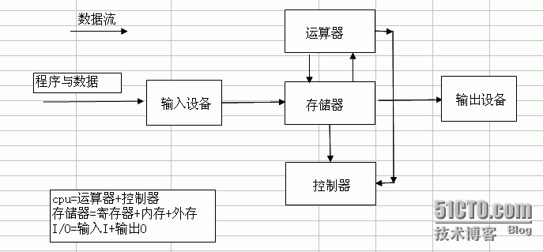
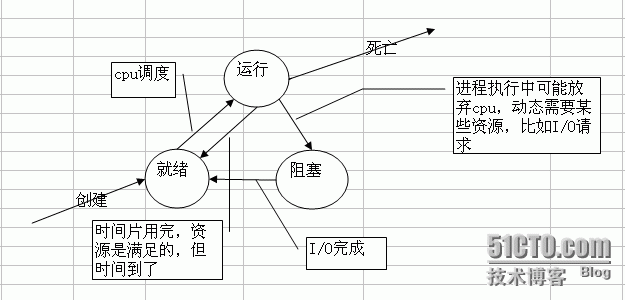
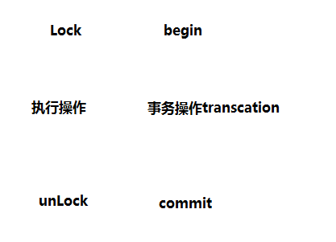
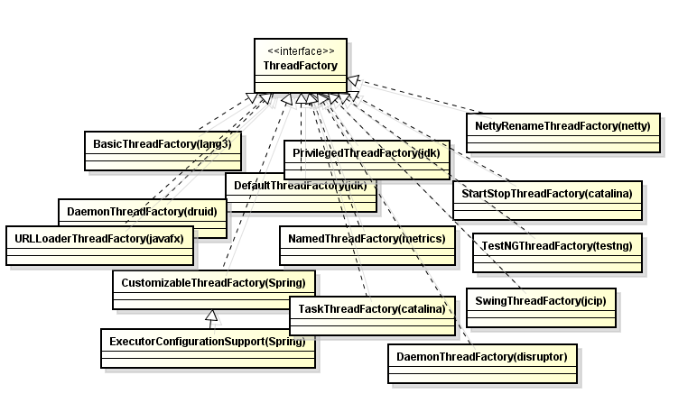
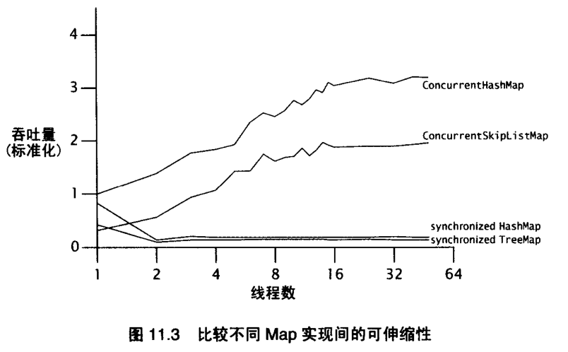
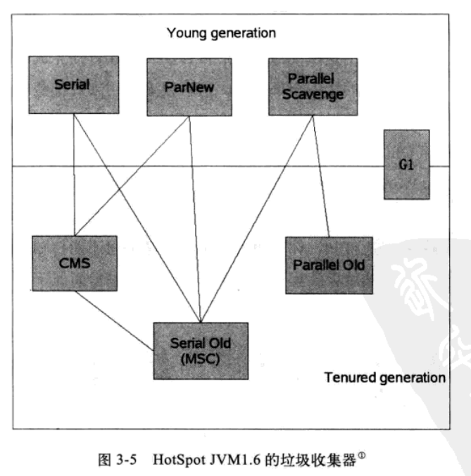

# 第三章

* 201 干一行，爱一行

---

* 202 为什么要做技术？生存？一个领域有成就？对事物本身的理解？推动业务发展？出人头地？有所成就，有所高度。 有所领悟，有所得失。

---

* 203 真正的学习的以不断完善思考能力为基础的，其次才是记忆。只有记住了大量知识才谈理解，只有理解了才会大量记住，才谈融会贯通。

---

* 204 看完书记不住，因为没有理解。更重要的没有融汇贯通。任督二脉....

---

* 205  所有性能问题都来自：CPU，内存，IO，所有的瓶颈都是这三项。



---

* 206 线程状态



---

* 207 世界是分形的。一种哲学观点。


计算机系统是自下而上的分形系统，在CPU层面看到的东西，在磁盘层面看到的东西，在os层面看到的东西，在软件应用看到的东西，其实都是一个东西，没有特别明显的差异。无非怎么做信号？怎么做相互通知机制？怎么做时间片切换？无非这么几件事。只是不同的层次因为不同的需要而改变。问题本质没变化，无非怎么通信，怎么计算，怎么数据存取，只有这么几件事情。收拢到简单关键词时候，就是树状结构。形成这种认知，往外看，计算机不过如此，特定场景特定的优化而已。大部分特定优化其实并不复杂。多问为什么，问题本质是什么？构造图景理解新的问题就会很快。\[DB，应用系统，os，分布式软件最终都要在CPU上执行\]

---

* 208 计算机问题：分层与分形。

---

* 209 响应时间级别： **内存**：纳秒，   **网络**：毫秒，5000-10000**时钟周期**：几微秒

---

* 210 数据库的事务和Java中的并发解决方案，本质是一回事。数据库成为操作远程共享数据叫事务，而应用操作本地共享数据，内存中的共享数据叫并发。



---

* 211  一个技术的利与弊就是选了他，得到了什么，失去了什么。对于业务取舍了什么，又得到了什么。

---

* 212 世界上解决一个计算机问题最简单的方法：“恰好”不需要解决它！——  [沈询](http://i.youku.com/u/UMTcwMTg3NDc1Mg==?from=113-2-1-2)

---

* 213 系统如果需要高性能，必然要进行精心的设计。必须有所取舍。计算机解决方案就是一个折中的过程。解决一个问题就会带来另外一个问题。

---

* 214 复杂的模型越难理解，但是性能越好。越简单的模型，性能往往不好。快速排序和冒泡排序。

---

* 215 吞吐量问题\(单位时间内处理更多的任务\)的解决方案：硬件层面，CPU层面，操作系统层面，应用系统层面。

  ```
           高可用问题解决方案：冗余。
  ```

---

* 216 程序员觉得程序是顺序执行的，其实在CPU层面是乱序的。什么不能乱？Happen-Before规则。维持有序系统需要付出代价。乱不是目的，目的是高效利用CPU。

---

* 217 消息交互三模型：推，拉，推拉结合。Kafka拉模型，适合海量日志处理，日志处理特点是不需要实时性-》消息堆积能力必然强-》占内存。

---

* 218  协议是合约解决问题的一种方式。一种协议的产生必然会带来另一钟问题的产生。Paxos协议，TCP协议，Zab协议。解决不了问题，加层，加层做什么？加协议。多台机器数据同步，怎么同步？数据层加paxos协议。技术选型就是一个取舍的过程。

---

* 219 并发控制产生根源是CPU宏观并行，微观串行。多线程对共享数据的读读，读写，写读，写写。

---

* 220 性能问题分析：自上而下，自下而上。所有的数据读写问题都可以转化为CPU层面读写问题。

---

* 221 所有的折中都在时间和空间层面折中。时间足够长，所有消息都是有序的，但是没有意义。将时间压缩到空间，追求更加巧妙的设计。

---

* 222我们所得到的和所失去的都会在CPU，内存，IO上得到体现。

---

* 223 这张图代表了什么？


---

* 224 排序算法比较\[log2\(n\) log以2为底的n\]

| **排序算法** | **最好时间** | **平均时间** | **最坏时间** | **辅助空间** | **稳定性** |
| :--- | :--- | :--- | :--- | :--- | :--- |
| 直接插入排序 | O\(n\) | O\(n^2\) | O\(n^2\) | O\(1\) | 稳定 |
| 希尔排序 | O\(n\(log2\(n\)\)^2\) | O\(n^1.3\) |  | O\(1\) | 不稳定 |
| 直接选择排序 | O\(n^2\) | O\(n^2\) | O\(n^2\) | O\(1\) | 不稳定 |
| 堆排序 | O\(nlog2\(n\)\) | O\(nlog2\(n\)\) | O\(nlog2\(n\)\) | O\(1\) | 不稳定 |
| 冒泡排序 | O\(n\) | O\(n^2\) | O\(n^2\) | O\(1\) | 稳定 |
| 快速排序 | O\(nlog2\(n\)\) | O\(nlog2\(n\)\) | O\(n^2\) | O\(log2\(n\)\) | 不稳定 |
| 归并排序 | O\(nlog2\(n\)\) | O\(nlog2\(n\)\) | O\(nlog2\(n\)\) | O\(n\) | 稳定 |
| 基数排序\(链式队列\) | O\(mn\) | O\(mn\) | O\(mn\) | O\(n\) | 稳定 |
| 基数排序\(顺序队列\) | O\(mn\) | O\(mn\) | O\(mn\) | O\(mn\) | 稳定 |

---

* 225 JMM核心概念：
* 原子性\(一个操作不可中断\)
* 可见性\(一个线程改变了值，另其他线程立马得知，Volatile\)
* 有序性\(线程内有序，线程间观察无序，指令重排，Happen-Before\)。

---

* 226 哪些指令不能重排：Happen-Before。

---

* 227 Volatile作用：可见性和禁止指令重排，比synchronized更轻量级同步机制。

场景：1 volatile最适用一个线程写，多个线程读的场合  2  检查某个状态标记以判断是否退出循环。

```
volatile boolean shutdownRequested;  //不加volatile可能会导致指令重排，-server模式产生死循环
public void shutdown() { 
     shutdownRequested = true; 
}
public void doWork() { 
    while (!shutdownRequested) { 
        // do stuff
    }
}
```

---

* 228 加锁可以保证原子性和可见性，但是volatile只能保证可见性。

---

* 229 使用场景：BIO：低负载，低并发    NIO：高负载，高并发    AIO：异步处理

---

* 230 排序算法一览：

| **插入排序** | **直接插入** | **希尔排序** |
| :--- | :--- | :--- |
| **选择排序** | **直接选择** | **堆排序** |
| **交换排序** | **冒泡排序** | **快速排序** |
| **归并排序** | **桶排序** |  |

**插入排序：**

直接插入排序：

```java
public static void insertSort(int[] keys) {
    for (int i = 0; i < keys.length; i++) {
        int temp = keys[i];
        int j;
        for (j = i - 1; j >= 0 && temp < keys[j]; j--) {
            keys[j + 1] = keys[j];
        }
        keys[j + 1] = temp;
        System.out.print("第" + i + "趟 temp=" + temp + "\t");
        System.out.println(Arrays.toString(keys));
    }
}
```

```java
public static void insertSort2(int[] keys) {
    for (int i = 0; i < keys.length - 1; i++) {
        int temp = keys[i + 1];
        int j = i;
        while (j > -1 && temp < keys[j]) {
            keys[j + 1] = keys[j];
            j--;
        }
        keys[j + 1] = temp;
        System.out.print("第" + i + "趟 temp=" + temp + "\t");
        System.out.println(Arrays.toString(keys));
    }
}
```

希尔排序:

```java
public static void shellSort1(int[] keys) {
    //每次增量减半，初始为数组长度
    for (int delta = keys.length / 2; delta > 0; delta /= 2) {
        for (int i = delta; i < keys.length; i++) {
            int temp = keys[i], j;
            for (j = i - delta; j >= 0 && temp < keys[j]; j -= delta) {
                keys[j + delta] = keys[j];
            }
            keys[j + delta] = temp;
        }
        System.out.print("delta=" + delta + "  ");
        System.out.println(Arrays.toString(keys));
    }
}
```

```java
/**
 *
 * @param keys 数组
 * @param n  数组个数
 * @param d  增量数组 [6,3,1]
 * @param numOfD  增量数组个数 3
 */
public static void shellSort2(int[] keys, int n, int[] d, int numOfD) {
    int i, j, k, m, span, temp;
    for (m = 0; m < numOfD; m++) {
        span = d[m];
        for (k = 0; k < span; k++) {
            for (i = k; i < n - span; i += span) {
                temp = keys[i + span];
                j = i;
                while (j > -1 && temp <= keys[j]) {
                    keys[j + span] = keys[j];
                    j = j - span;
                }
                keys[j + span] = temp;
            }
        }
        System.out.print("delta=" + span + "  ");
        System.out.println(Arrays.toString(keys));
    }
}
```

**交换排序**

冒泡排序

```java
public static void bubbleSort(int[] keys) {
    int flag = 1;
    int n = keys.length;
    for (int i = 1; i < n && flag == 1; i++) {
        flag = 0;
        for (int j = 0; j < n - i; j++) {
            if (keys[j] > keys[j + 1]) {
                int temp = keys[j + 1];
                keys[j + 1] = keys[j];
                keys[j] = temp;
                flag = 1;
            }
        }
        System.out.print("第" + i + "趟: ");
        System.out.println(Arrays.toString(keys));
    }
}
```

```java
public static void bubbleSort2(int[] keys){
    boolean exchange = true;
    for (int i = 1; i < keys.length && exchange; i++) {
        exchange = false;
        for (int j = 0; j < keys.length - i; j++) {
            if (keys[j] > keys[j + 1]) {
                int temp = keys[j];
                keys[j] = keys[j + 1];
                keys[j + 1] = temp;
                exchange = true;
            }
        }
        System.out.print("第" + i + "趟: ");
        System.out.println(Arrays.toString(keys));
    }
}
```

快速排序

```java
public static void quickSort(int[] keys, int begin, int end) {
    if (begin < end) {
        int i = begin;
        int j = end;
        int vot = keys[i]; //标准元素
        while (i != j) {
            while (i < j && vot <= keys[j]) j--;
            if (i < j) {
                keys[i++] = keys[j];
            }
            while (i < j && keys[i] <= vot) i++;
            if (i < j) {
                keys[j--] = keys[i];
            }
        }
        keys[i] = vot;
        System.out.print("["+begin + "-" + end + "],  vot=" + vot + "  ");
        System.out.println(Arrays.toString(keys));
        quickSort(keys, begin, j - 1);
        quickSort(keys, i + 1, end);
    }
}
```

```java
public static void quickSort2(int[] keys, int begin, int end) {
    if (begin < end) {
        int i = begin;
        int j = end;
        int temp = keys[i]; //标准元素
        while (i < j) {
            while (i < j && temp <= keys[j]) j--;
            if (i < j) {
                keys[i] = keys[j];
                i++;
            }
            while (i < j && keys[i] < temp) i++;
            if (i < j) {
                keys[j] = keys[i];
                j--;
            }
        }
        keys[i] = temp;  //插入标准元素
        System.out.print("["+begin + "-" + end + "],  temp=" + temp + "  ");
        System.out.println(Arrays.toString(keys));
        quickSort2(keys, begin, i - 1);
        quickSort2(keys, j + 1, end);
    }
}
```

**选择排序**

直接选择排序

```java
public static void selectSort(int[] keys) {
    for (int i = 0; i < keys.length - 1; i++) {                                                  
        int min = i;                                     
        for (int j = i + 1; j < keys.length; j++)           
            if (keys[j] < keys[min]) {
                min = j;
            }
        if (min != i) {
            int temp = keys[i];
            keys[i] = keys[min];
            keys[min] = temp;
        }
        System.out.print("第" + (i + 1) + "趟: ");
        System.out.println(Arrays.toString(keys));
    }
}
```

堆排序

```java
public static void heapSort(int[] keys){
    heapSort(keys,true);
}

public static void heapSort(int[] keys, boolean minHeap) {
    for (int i = keys.length / 2 - 1; i >= 0; i--) {
        //创建最大堆or最小堆
        sift(keys, i, keys.length - 1, minHeap);
    }
    for (int i = keys.length - 1; i > 0; i--) {
        //交换顶部和底部元素
        int temp = keys[0];
        keys[0] = keys[i];
        keys[i] = temp;
        sift(keys, 0, i - 1, minHeap);
        System.out.println("第" + (keys.length - i) + "趟" + Arrays.toString(keys));
    }
}

private static void sift(int[] keys, int parent, int end, boolean minHeap) {
    //System.out.println("sift " + parent + "..." + end + "  ");
    int child = 2 * parent + 1;
    int value = keys[parent];
    while (child <= end) {
        if (child < end && (minHeap ? keys[child] > keys[child + 1] : 
                        keys[child] < keys[child + 1])) {
            child++;
        }
        if (minHeap ? value > keys[child] : value < keys[child]) {
            keys[parent] = keys[child];
            parent = child;
            child = 2 * parent + 1;
        } else {
            break;
        }
    }
    keys[parent] = value;
}
```

```java
public static boolean isMinHeap(int[] value) {
    if (value.length == 0) {
        return false;
    }
    for (int i = value.length / 2 - 1; i >= 0; i--) {
        int j = 2 * i + 1;
        if (value[i] > value[j] ||
                 j + 1 < value.length && value[i] > value[j + 1]) {
            return false;
        }
    }
    return true;
}

public static boolean isMaxHeap(int[] value) {
    if (value.length == 0) {
        return false;
    }
    for (int i = value.length / 2 - 1; i >= 0; i--) {
        int j = 2 * i + 1;
        if (value[i] < value[j] ||
                 j + 1 < value.length && value[i] < value[j + 1]) {
            return false;
        }
    }
    return true;
}

public static void whatKindOfHeap(int[] value) {
    if (isMinHeap(value)) {
        System.out.println("最小堆");
    }else if(isMaxHeap(value)){
        System.out.println("最大堆");
    }else{
        System.out.println("非最大堆或者最小堆");
    }
}
```

**归并排序**

```java
public static void mergeSort(int[] X) {
    System.out.println("归并排序");
    int[] Y = new int[X.length];
    int n = 1;
    while (n < X.length) {
        mergepass(X, Y, n);
        System.out.println(Arrays.toString(Y));
        n *= 2;
        if (n < X.length) {
            mergepass(Y, X, n);
            System.out.println(Arrays.toString(X));
            n *= 2;
        }
    }
}

private static void mergepass(int[] X, int[] Y, int n) {
    System.out.print("子序列长度n=" + n + "  ");
    int i = 0;
    for (i = 0; i < X.length - 2 * n + 1; i += 2 * n) {
        merge(X, Y, i, i + n, n);
    }
    if (i + n < X.length) {
        merge(X, Y, i, i + n, n);
    } else {
        for (int j = i; j < X.length; j++) {
            Y[j] = X[j];
        }
    }
}

private static void merge(int[] X, int[] Y, int m, int r, int n) {
    int i = m, j = r, k = m;
    while (i < r && j < r + n && j < X.length) {
        if (X[i] < X[j]) {
            Y[k++] = X[i++];
        } else {
            Y[k++] = X[j++];
        }
        while (i < r) {
            Y[k++] = X[i++];
        }
        while (j < r + n && j < X.length) {
            Y[k++] = X[j++];
        }
    }
}
```

---

* 231 排序算法：[算法详情](https://gitee.com/xiaozhiliao/algorithm/blob/master/src/main/java/chapter9/sort/Sort.java)

---

* 232 分布式的好处：理论上无限可扩展能力和高可用能力。

---

* 233 消息中间件作用：解耦，异步，最终一致性，并行

---

* 234沈询：“特别注重基础，操作系统、网络、算法数据结构、离散数学、数据库原理与实践，这些看起来枯燥而无味的基础科学，是我目前感到知识最为匮乏，但却最为急需的部分，要了解它们是必须付出非常多的时间才有可能理解通透些。而这些基础的扎实程度，就直接决定了你的高度”。

---

* 235 线程与QPS计算公式\(吞吐量提升一倍，服务器数量减少一半\)

  ```
          线程数 = （线程总时间/瓶颈资源时间） *  瓶颈资源线程并行数

          QPS = （1000/响应时间[线程总时间]）* 线程数 = 1000/瓶颈资源时间 * 瓶颈资源并行数

          QPS和响应时间没有关系，优化响应时间效果不大。
  ```

---

* 236 QPS三要素：线程，响应时间，瓶颈资源。

  ```
      QPS瓶颈：磁盘IO，网络IO，CPU，内存GC hold，线程限制，线程同步锁，远程系统QPS
  ```

---

* 237 JUC

> 

JUC [详情   ](https://docs.oracle.com/javase/9/docs/api/java/util/concurrent/package-summary.html)

---

* 238 JUC使用场景：

ReentantLock \(互斥锁,可重入锁,独占锁-Mutex-读读互斥\)可定时，可轮询，可中断，公平队列，非块结构加锁。

ReentrantReadWriteLock  \(读写锁-读读共享\) 一个共享资源被大量读取操作，而只有少量写操作。

StampedLock   实现乐观悲观锁

Volatile  一个线程修改，多个线程读取

CopyOnWrite  读多写少 白名单，黑名单，商品类目访问和更新

DelayQueue  缓存系统设计，定时任务调度

LinkedBlockingDeque  ForkJoinPool 工作窃取算法

BlockingQueue 生产者消费者模式实现

ConutDownLatch 等待某个条件满足后才做后面的事情。Zk连接集群的时候。

AbstractQueuedSynchronizer  实现自己的同步器

Semaphore 流量控制 资源有限情况。排队场景，线程池，连接池等

CyclicBarrier N个线程互相等待  用于多线程计算数据，最后合并计算结果

ForkJoinPool  任务拆分在汇总的计算

ThreadLocal 线程内变量 Connection，防止对可变单利变量或者全局变量进行共享。

SynchronousQueue 有足够多消费者，并且总有一个消费者准备好交付工作的情况下使用

Deque\(ArrayDeque,LinkedBlockingDeque\) 即是生产者也是消费者问题。执行某个工作时候可能出现更多的工作。

Exchanger 遗传算法，校对工作\(AB-excel\)

ExecutorCompletionService 向Executor提交一组计算任务，计算完成后分别获得计算结果。

Future.get  指定时间内没有完成，则取消任务    任务没有完成则阻塞   指定时间完成某些任务，**页面渲染器**，指定时间获取广告信息

守护线程：执行辅助工作，执行“**内部**”任务，周期性从内存的缓存中清除过期数据。不用于应用程序服务的生命周期

...待补充

---

* 238 优先使用有界队列：1 稳定性和预警  2  单一模块不可用不会造成整个系统不可用  3  强大的资源管理工具，防止产生过多的工作项，使得程序在负载过荷情况下变得更加健壮。

无界队列：内存撑满问题。

---

* 239 线程池线程数的一种思考：

1  Tomcat，Nginx 最大限度发挥单机server最大并发量。

2   CPU密集：N$$cpu$$+1  or N$$cpu$$ -1   IO密集型  2 \* N$$cpu$$

3   IO+CPU差不多：   \(N$$cpu$$+1  +  2 \* N$$cpu$$\)/2

---

* 240 _**线程安全：**_当多个线程访问某个类时，不管运行时环境采用何种调度方式，或者这些线程将如何交替执行，并且在主调代码中不需要任何额外的同步或协同，这个类都能表现出正确的行为，那么就称这个类是线程安全的。
* 简单定义：**当多个线程访问某个类的时候，这个类始终表现出正确的行为，那么这个类就是线程安全的。**

---

* 241 对象一些状态的**共享**和**可变**决定了对象是否线程安全。线程安全最核心的概念是正确性。正确性是某个类的行为与其规范完全一致。单线程正确性是“所见即所知”。

---

* 242 JUC分类：
* **1  并发集合**  BlockingQueue   CopyOnWrite\(CopyOnWriteArrayList,CopyOnWriteArraySet\)             Concurrent\(ConcurrentHashMap,ConcurrentLinkedDeque，ConcurrentLinkedQueue，ConcurrentSkipListMap，ConcurrentSkipListSet\)
* **2  同步器**   Semphore  CountDownLatch  CyclicBarrier   Exchanger  FutureTask\(语义上的\)
* **3  执行器**   Executors  Callable  ThreadPoolExecutor  Future
* **4  锁和条件类**  Synchronized  ReentrantLock  ReentrantReadWriteLock  StampedLock  Condition  LockSupport
* **5  原子变量**   AtomicXXX

---

* 243 **AQS **  

---

* 244 **Queue**  

---

* 245 **Lock  **

---

* 246 实现等待通知

| 等待/通知 | 等待 | 通知一个 | 通知所有 |
| :--- | :--- | :--- | :--- |
| Condition\(Lock\) | await | signal | signalAll |
| Object | wait | notify | notifyAll |

---

* 247 所有**并发问题**都可以归结为如何**协调**对**并发状态**的访问。可变状态越少，越容易保证**线程安全性**。

---

* 248 服务器程序应该体现出良好的**吞吐量**和快速的**响应性**。

---

* 249 在一定范围内，增加线程可以提供系统吞吐量，但是超出范围，反而降低性能。\(创建开销，资源消耗占内存，GC压力\)

---

* 250 实现一个线程：**Thread**\(单继承局限\)，**Runnable**\(不能返回值或者抛出受检异常，多继承\)，**Callable**\(有返回值，泛型\)

  Runnable和Callable都是对任务的抽象。

---

* 251 **同构任务**并行化\(真正的性能提升\)和**异构任务**并行化\(获取重大性能提升很困难\)

---

* 252 中断是一种**协作机制**。它不会真正中断运行的线程，而只是发出中断请求，然后线程在下一个合适的时间中断自己。

---

* 253 通常，**中断**是实现取消的最合理方式。也可以循环检测某个**状态位\(volatile\)**取消。

---

* 254 幂等：多次请求得到结果一样。

---

* 255 Java线程分为两类：普通线程，守护线程。两者唯一区别仅在于：线程退出时候的操作。

---

* 256 提问的技巧：所有问题后面加**实现原理**。AQS**原理**，线程池**原理**，ArrayList**原理**，synchronized** 原理  **，分布式事务**原理**，Condition**原理**，AOP**原理**，Spring事务实现**原理**.......

---

* 257 **ThreadFactory**很受欢迎 ！！！ 

---

* 258 线程池作用：_**1**_ **提高执行任务性能**   _ **2** _**资源管理**  

从ThreadPoolExecutor理解线程池的原理：Core and maximum pool sizes，On-demand construction，Creating new threads，Keep-alive times，Queuing，Rejected tasks，Hook methods，Queue maintenance，Finalization。

详情请看 [这里](http://docs.oracle.com/javase/8/docs/api/java/util/concurrent/ThreadPoolExecutor.html)

```java
public ThreadPoolExecutor(int corePoolSize,
                                int maximumPoolSize,
                                long keepAliveTime,
                                TimeUnit unit,
                                BlockingQueue<Runnable> workQueue,
                                ThreadFactory threadFactory,
                                RejectedExecutionHandler handler){}
```

---

* 259 阿姆达尔定律告诉我们：光加CPU不一定吞吐量上的去，还要考虑程序串行比。

---

* 260 阿姆达尔定律：在增加计算资源的情况下，程序理论达到的最高加速比取决于程序的串行化比例。

---

* 261

---

* 262 内存栅栏（内存屏障）：刷新缓存使缓存无效，刷新硬件的写缓存以及停止执行管道，抑制编译器优化，实现内存顺序限制，操作是不能被重排序的。

---

* 263 **悲观锁**适合并发争抢比较严重的场景;**乐观锁**适合并发争抢不太严重的场景。
* 等待时间较短，适合自旋等待\(JVM实现阻塞\)。等待时间较长，采取os挂起。

---

* 264 非竞争同步可以在JVM中处理，竞争的同步可能需要os介入。

---

* 265 阻塞的本质是**等**。非阻塞同步算法还是要**等**。等 = for\(;;\){}

---

* 266 Little定律：在一个稳定系统中，顾客平均数量 = 平均到达率 \* 平均停留时间
* 系统中物体的**平均数量**等于物体离开系统的**平均速率**和每个物体在系统中**停留的平均时间**的乘积

---

* 267 通常，对象**分配**操作\(new \)的开销比**同步**开销更低。所以对**对象池**说“不”。

---

* 268  

后半段，随着线程数增加，吞吐量趋于稳定，因为大部分时间消耗在上下文切换和调度延迟上。线程太多不好，太少也不好。

---

* 269 上下文切换：运行和阻塞之间转换。

---

* 270 提升**可伸缩性**：1 减少锁持有时间  2  降低锁粒度\(锁分解，锁分段\)  3  采取非独占锁  4  非阻塞锁代替阻塞锁

---

* 271 一种学习思路：性能调优。log4j性能调优，kafka性能调优，redis性能调优，ngnix性能调优，jvm性能调优，mysql性能调优....

---

* 272 Java中的**锁**\(ReentrantLock-非阻塞加锁\)必须要和内置锁\(Synchronized-阻塞加锁\)**必须**提供一样的**内存语义（可见性,原子性,顺序性）**。但是实现可以不同。monitorenter,monitorexit和CAS\(CMPXCHG\),实现的核心不在于锁，而在于如何实现一样的**内存语义**

---

* 273 读写锁：写可以降低为读，而读不能升级为写。因为会发生**死锁**。

---

* 274 hash算法的评估：单调性和平衡性。**一致性hash**主要用在缓存系统。移除/添加一个cache时候，尽可能少的改变已存在的key映射关系，满足单调性。

---

* 275 **一致性hash**映射过程：1  构建环形hash空间  2  对象映射到hash空间  3  cache映射到hash空间  4  对象映射到cache上。

---

* 276 分布式的理论：CAP 。\(强一致性，可用性，分区容错性\)

CA-》RDBMS-》ACID-》强一致性

AP-》NoSQL，DNS，QQ头像修改-》BASE\(基本可用，软状态，最终一致性\)-》最终一致性

CP-》分布式DB

---

* 277 **ACID **VS **BASE**

| 比较 | ACID | BASE |
| :--- | :--- | :--- |
| 一致性 | 强一致性 | 最终一致性 |
| 特征 | 一致性优先 | 可用性优先 |
| 方法 | 悲观 | 乐观 |
| 适应变化 | 难以变化 | 适应变化 |

---

* 278 **基础知识**是打通知识体系的针线。对**基本问题**思考越深，对**变化**就会越理解，对**现象**也就越理解。因为计算机学科基础问题决定了上层建筑的扎实程度。

---

* 279 计算机学科基础问题有哪些？  

---

* 280  数据库理论很完备了。实际运用可能会完善和补充理论，但是不会超越理论。

---

* 281 请求servlet


---

* ## 282 Cookies原理
* 283 Session原理

---

* 284 Servlet工作图


---

* 285 对比

**Cookis**，保留用户上次登录时间，保存浏览记录，登录不用重复输入密码，记录用户喜好\(背景色，有无背景音乐\)，网站个性化\(定制服务\)，

**Session** 购物车，全局用户名，防止用户非法登录到某个界面，用户验证码，判断新用户，取得用户操作时间，注销用户，

**ServeltContext**\(application对象\) 在线人数，累计访问量\(db,file,servletContext\)，公共聊天室，多个Servlet通过ServeltContext共享数据，获取web初始化参数，读取WEB目录和WEB-INF目录文件，聊天系统，网站在线用户显示，


---

* 286  有生命周期的对象:JVM加载Class对象，SpringBean生命周期，Servlet生命周期，线程生命周期，线程池生命周期，Hibernate对象生命周期，对象生命周期\(JVM GC机制核心\)。

---

* 287 JSP和Servlet都是单例模式，多个请求对应一个JSP/Servlet。

---

* 288 JSP原理


---

* 289 一个类是否是同一个类，有两个条件。 1 包名.类名是否相同。  2  加载这个类的ClassLoader是否是同一个。

---

* 290 同一个ClassLoader不能同时加载两个相同的类，但是同一个类可以被两个不同的ClassLoader加载。

---

* 291 类加载机制


---

* 292 GC解决了下面三问题： 1 哪些内存需要回收？\(堆和方法区\)  中已经"**死**"的对象？ 1 引用计数  2  可达性分析算法    
* 2  什么时候回收？    3  如何回收？

---

* 293 垃圾收集器



---

* 294 垃圾回收算法： 1  标记-清除  2  复制算法  3 标记-整理   4  分代收集算法\(hotspot\)

---

* 295 Java是一种静态多分派，动态单分派的语言。

方法调用：1   解析   2  分派\(静态分派-重载，动态分派-覆写\)

---

* 296 Java是一种动态语言\(反射\),但是是静态类型语言。

---

* 297  动态类型语言：变量无类型而变量值才有类型。

动态语言：Java  静态语言：C/C++

动态类型语言：Js，Python  静态类型语言：C/C++，Java

---

* 298  代码编译的结果从本地机器码转变为字节码，是存储格式发展的一小步，却是编程语言发展的一大步。

---

* 299 Java程序信息分为： 代码\(Code属性\)和元数据\(除去代码外所有的信息，注解，注释，javadoc\)。

---

* 300 理解字节码：

**SuppressPropertiesBeanIntrospector.class**和** String.class**

  @@VS@@

---


