是301 Synchronized原理分析\(Javac+Java虚拟机共同协作，比如JMM层面\)：

方法：常量池flags=**ACC\_SYNCHRONIZED**

代码块：字节码指令  **monitorenter**和**monitorexit**

机器码：**lock**\(read,load,use\),**unlock**\(store,write,assign\)

---

* 302 世界上没有完美的程序，但是我们不应该沮丧，因为写程序本身就是一个不断追求完美的过程。

---

* 303 执行Java程序

---

* 304 理解**运行时**

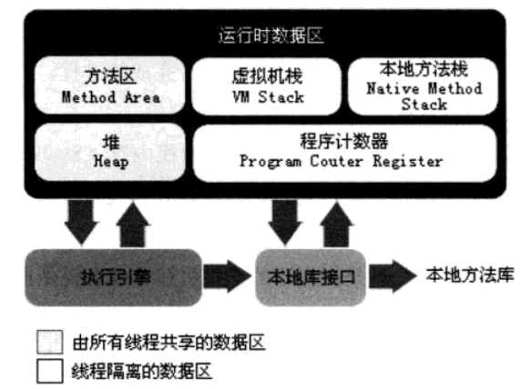

---

* 305 为什么JVM采用分代回收策略？基于观察事实：1 大部分分配对象的存活时间很短 2 存活时间久的对象很少引用存活时间短的对象。基于弱分带假设。

---

* 306 MinorGc触发条件：Eden没有足够内存空间来分配对象。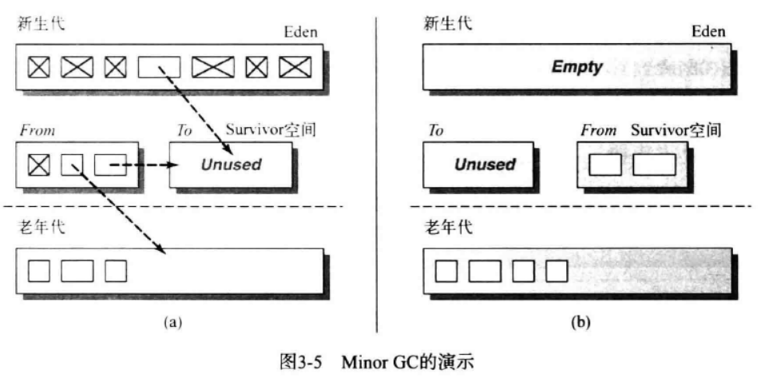

---

* 307  垃圾回收器工作图解

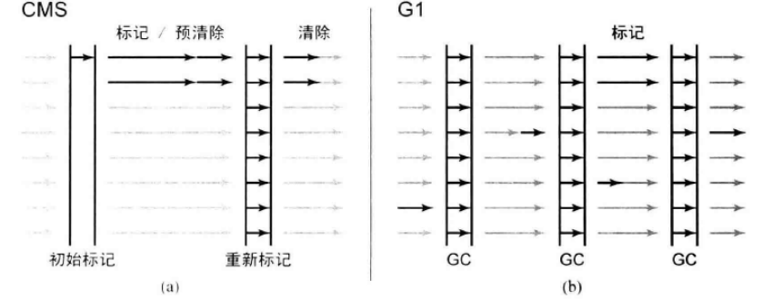

---

* 308 Java学的好的标志：掌握从java层到jvm层映射。例如：对象池会加大老年代的存活时间，不好的编程实践，ArrayList给定初始化尺寸，内部数组不断调整，导致不必要的内存分配。

---

* 309 程序怎么优化？1 吞吐量 2  响应性   这些优化映射到CPU，内存，IO层上，在映射到Java层，就体现出掌握JVM内存分配的重要性了。

---

* 310 程序优化本质是一个调整映射过程。代码到jvm到os到机器。区别不同在于自上而下还是自下而上。

---

* 311 MinorGC：新生代垃圾收集。   FullGC：整个堆\(新生代+老年代+永久区\)收集。

MinorGC：当Eden区满时，触发Minor GC。

FullGC：1  System.gc   2  老年代空间不足  3  永久代空间不足   4  CMS GC时出现promotion failed和concurrent mode failure   5   统计得到的Minor GC晋升到旧生代的平均大小大于老年代的剩余空间   6  堆中分配很大的对象

---

* 312 缓存命中率和和缓存大小没有关系。频繁UPDATE操作，缓存设置再大也没有用。命中率取决于工作负载。

---

* 313 InnoDB是大多数情况下最好的选择。

---

* 314 MySQL服务器逻辑架构图：

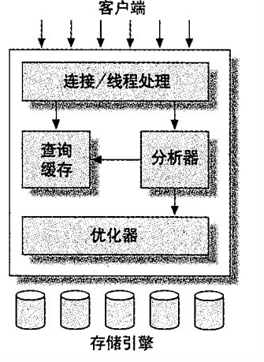

---

* 315 MySQL逻辑详细图

---

* 316 垃圾回收器本质是一种空间管理技术。缓存也是。只不过一个希望对象存活久，一个希望对象存活短。而垃圾回收机制对应缓存的清除策略。反面想，缓存的设计也可以划分为年轻代与老年代。此时对象更希望进入老年代，保持长期有效对象。此时关键在于缓存数据结构的设计。

---

* 317 内存回收技术反面就是内存不回收策略。也就是内存常驻技术。

---

* 318 设计一个垃圾回收器的思路：  1  分布式垃圾回收器，两个jvm运行一段程序 ，n个jvm，n台机器，在提供一个抽象网络jvm层     2    高并发的垃圾回收器     3    反垃圾回收器  

4   插件体系架构类似存储引擎的垃圾回收器，每一部分做成可插拔式的。 精简版，按需定制。对外提供API。开源社区提供插件。

---

* 319  性能优化的前提是监控与统计，否则无从谈起。

---

* 320 MySQL调优顺序：1 Schema与数据类型优化  2   索引优化    3   查询优化   4  优化服务器设置   5   操作系统与硬件优化  6  应用层优化   -《高性能的MySQL》   完美调优不存在，服务器设置是调优时间投入产出很小的调优。而前三者投产比大。

---

* 321 my.cnf的配置：映射到os，io，cpu，内存。zk，nginx也是如此。

---

* 322 进程间通信是所有分布式系统的核心。不谈分布式机器间信息交换机制，对分布式系统研究成了空谈。

---

* 323 对分布式系统研究角度：

1 体系结构：集中，非集中，混合？

2  进程：线程实现？虚拟化？客户端？服务端？代码迁移？

3  通信 ：远程过程调用（同步RPC，异步RPC），消息通信（瞬间与持久）

4  命名

5  同步

6  一致性与复制

7  容错性

8 安全性

---

* 324  学习网络其实本质是在学协议栈。如何层与层之间通信，也就是信息交换机制。

---

* 325  协议是解决方法的高级抽象。TCP协议思路也可以应用到应用程序，仅此而已。

---

* 326  **OSI**看所有分布式系统都只是**应用程序**而已。
* 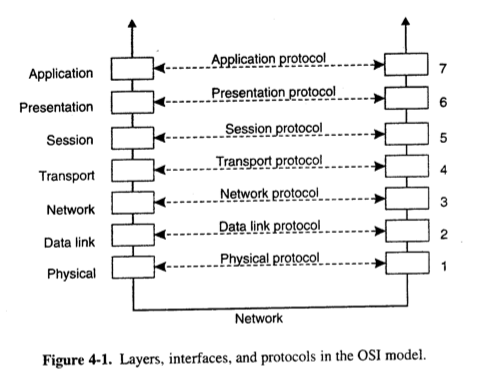

调整后的网络通信模型。越往下，越通用，越抽象，越不变。

---

* 327  中间件协议：**认证协议**，**授权协议**，**分布式提交协议**（在一组进程内，某种操作要么由全部进程共同完成，要么不执行），**分布式锁定协议**（保护资源免受分布于多台机器上一组进程的并发访问），**通信协议等**。均与应用程序无关的协议。可用来实现通用的中间件服务。

---

* 328  通信模型

| 分类 | 持久通信 | 瞬间通信 |
| :--- | :--- | :--- |
| 同步通信 | 消息队列（请求提交时同步化） | RPC（请求完全处理后同步化） |
| 异步通信 | mom | Berkeley套接字，mpi |

---

* 329 参数传递机制：1  call by value  2  call by reference  3  call by copy/restore （Ada语言）取决于语言设计者。

---

* 330 构建服务器的三种方式： 1  单线程  2  多线程  3 有限状态机

---

* 331  RPC分类：单向RPC，同步RPC，异步RPC（转账，启动远程服务，执行批处理），两步RPC（延迟的同步RPC）
* RPC系统（DCERpc，SunRpc），RPC框架（gRpc偏重于语言）

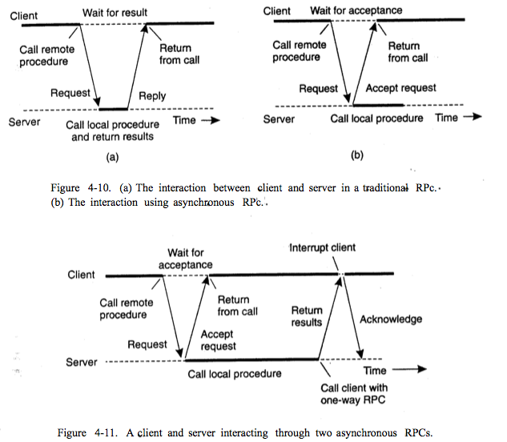，

---

* 332  两个节点交换更新信息方式：1 pull 2 push 3 pull-push  感染算法：传播更新信息。

---

* 333   互联网架构八荣八耻，DevOps

**以可配置为荣，以硬编码为耻**

**以系统互备为荣，以系统单点为耻**

**以随时可重启为荣，以不能迁移为耻**

**以整体交付为荣，以部分交付为耻**

**以无状态为荣，以有状态为耻**

**以标准化为荣，以以特殊化为耻**

**以自动化工具为荣，以人肉操作为耻**

**以无人值守为荣，以人工介入为耻**

---

* 334 Java八荣八耻

**以动手实践为荣，以只看不练为耻。 **

**以打印日志为荣，以出错不报为耻。 **

**以局部变量为荣，以全局变量为耻。 **

**以单元测试为荣，以手工测试为耻。 **

**以代码重用为荣，以复制粘贴为耻。 **

**以多态应用为荣，以分支判断为耻。 **

**以定义常量为荣，以魔法数字为耻。 **

**以总结思考为荣，以不求甚解为耻。**

---

* 335 python之禅

Beautiful is better than ugly.Explicit is better than implicit.Simple is better than complex.Complex is better than complicated.Flat is better than nested.Sparse is better than dense.Readability counts.

Special cases aren't special enough to break the rules.Although practicality beats purity.

Errors should never pass silently.Unless explicitly silenced.

In the face of ambiguity, refuse the temptation to guess.

There should be one-- and preferably only one --obvious way to do it.Although that way may not be obvious at first unless you're Dutch.

Now is better than never.Although never is often better than  right now.

If the implementation is hard to explain, it's a bad idea.

If the implementation is easy to explain, it may be a good idea.

Namespaces are one honking great idea -- let's do more of those!

---

* 336  一种感悟：XXX性能优化，XXX优化，XXX设计总会归结于几个简单的思考出发点。IO，CPU，内存，磁盘。这是一种在计算机领域相同的思维逻辑，一种统一的思维出发点，无论再难的问题，执行总是在CPU进行读-取-执的过程循环。计算机是一个封闭的系统，系统内有其客观规律存在，不会超越硬件规律。存不存在一种通用的思考出发点去看待所有问题，但是解决方案却是不同的。知识无涯，而道有止。

---

* 337 为什么有时候学了原理好像没有什么用？因为对原理解决的简单问题，问题的演化，其他解决方案没有进行深入探索。出于简单的思考点，一步一步演化，才能真正理解原理。**消息队列的出发点是通信，而不是存储信息的容器，也不是Producer-Consumer模型，更不是Kafka**。而高性能Kafka一定通过其固有模型来映射OS层icmd来体现。但是通用的消息中间件所面临的设计问题的类似。通信方式有**RPC，消息，流，多播通信**。设计模式的出发点是代码复用，重构出发点是旧代码的重设计。

---

* 338 高性能指的是**ICMD**之间的权衡。对外体现给计算机一个任务他可以立马处理完。设计高性能的XXX中间件，离不开ICMD的权衡。Netty高性能也必然体现在此。IO多路复用和网络通道复用异曲同工。计算机处理问题方式和人处理问题方式没太大差别。都是人海战术。一个不行上两个\(多线程\)。**更多**和**更巧**体现了设计上的差异。

---

* 339 哪一个高才是你所需要突破的？高性能，高可用，高吞吐，高并发，高响应，高可扩，高体验，高收益？

---

* 340 三星索引设计过程：1  等值谓词放入索引。  2  order by 列放入索引。  3  其余列加入索引。

  一星：最小化索引片宽度。 二星：排除排序  三星：排除回表。

三星索引为什么快？ 一次查询只需要一次磁盘随机读和一次窄索引片的扫描。可能的最好索引。

---

* 341  

为其设计索引？

**两星索引**\(CITY,FNAME,LNAME\)，\(FNAME,CITY,LNAME\)

**一星索引**\(CITY,LNAME,FNAME\)，

**最差**\(LNAME,CITY,FNAME\)  CITY列不参与索引匹配

---

* 342  好的技术书一般都带设计，模式，原理，高性能，内幕，权威之类的字眼。这类书和XX天精通区别在于一个讲设计和原理，一个在讲应用。会用和会设计书两种能力。

---

* 343 分布式系统设计的公共特性与设计问题（设计层抽象）：

1  物理模型：硬件模型

2  体系结构模型：cs/p2p

3  基础模型：交互模型，故障模型，安全模型

分布式系统有其**公共的设计问题**，而不同类型的中间件也有其公共的设计问题。消息中间件和NoSql的公共设计问题不同，但是本质是**类似**的。技术选型的过程其实是理解其设计问题背后假设的一个过程，也就是应用场景问题。通用消息中间件设计问题有：消息重复和消息顺序问题。而这个设计问题属于基础模型中的故障模型。两者区别在于设计的抽象层不同。还有通用的RPC框架经典的设计问题等等【NELSON Implementing Remote Procedure Calls】

---

* 344 设计问题需要看Papper。

---

* 345  你能从**支持随机读写**的特性可以推断出其他什么特性？理解某一个开源应用的特性过程其实就是理解其设计问题背后假设的一个过程。可否特性推断，可否产品推断。MYSQL的inndb和myisam的设计问题代表一类软件的设计问题。

---

* 346 设计一个XXX系统？先思考假设是否成立。设计秒杀？这个问题本身就是错误的。抽象成：在极短时间进行对共享资源进行海量读写情况下，如何保证数据一致性以及系统的可用性？继续抽象：高并发的数据一致性问题。继续抽象：ICMD层。设计一个通用场景的解决方案难在**假设的正确性**。

---

* 347  任何“不完美的系统”必然存在某些形式上的妥协。

---

* 348 不完美的系统因为人类思维的局限性。即不可能预测未来。

---

* 349 从解决方案到设计方案的区别在于是否理解**基本的设计问题**。

---

* 350 TCP和UDP之间有趣权衡。UDP提供了简单消息传递机制，有遗漏故障却无性能故障。TCP保证消息传递，但需要以额外的消息高延迟和存储开销作为代价。

---

* 351 Consistent Hashing:本质是减少**remapping**的技术。在分布式中就是当节点离开或者加入时候使得原先节点变动最少。在缓存中意味着减少节点的缓存失效。其核心概念来自**DHT**。

---

* 352  当你不知道系统处于什么状态的情况下，要针对不同情况进行相应的**可接受**的**策略设计**，并设计**不可接受**的**补救措施**。比如悲观情况，乐观情况，最有可能情况，没有情况。分布式系统是一个证伪的技术范畴。作为证伪的系统体系中，你知道**不是**什么很容易，但是知道**是**什么很难。数据库的事务等级也是种假设，对读多写少进行设计是概率，不是必然。所以系统设计总不是完美的，因为你不可能考虑到所有假设情况。
* 经典的策略：乐观锁和悲观锁以及自旋锁等。补救措施：锁升级，但是锁升级又会带来设计上的复杂。设计复杂和性能优化的权衡。
* 高可用的数据复制策略以及数据刷盘的补救措施。

---

* 353 分布式系统的特点是什么，就是分布式数据库的特点，也就是消息队列的特点，也就是mysql集群的特点。

---

* 354 分布式系统是一个证伪的系统。

---

* 355 一致性问题本质是一个收敛性问题。所有节点值一样的情况下，系统是一种理想的平衡状态。A+B&gt;=2根号\(A\*B\)

---

* 356 读写分离以及主库只写，从库只读。本质是对“**所有节点均可读可写**”的简化。所有节点均可读可写情况下系统可以收敛吗？或者说可以系统状态一致吗？

---

* 357 [Roger Needham](https://en.wikipedia.org/wiki/Roger_Needham)  在计算机科学上，所有问题都可以通过某个层次上的间接方式来解决。

---

* 358 [Jim Gary](https://en.wikipedia.org/wiki/Jim_Gary) 没有通过消除某种层次上的间接方式解决不了的性能问题。

---

* 359 通信范型中时间与空间的耦合与解耦。

---

* 360 计算机最重要的能力是抽象能力，但是编程语言带来不了抽象性，数学可以带来抽象。

---

* 361 什么是计算？

---

* 362 集中式意味着缺少弹性和可伸缩性。更重要的是存在单点故障和性能瓶颈。

---

* 363 pub／sub系统设计体系

Pub/Sub例子

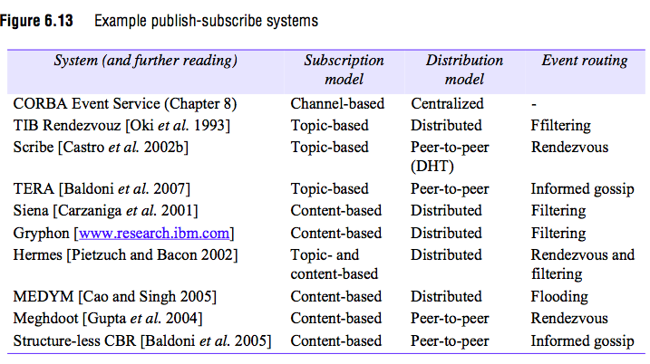

---

* 364 Do you know the future of jvm？the future of java？the future of data？the future of compute？ the future of language？

---

* 365 设计好的API先从方法命名和方法参数做起。

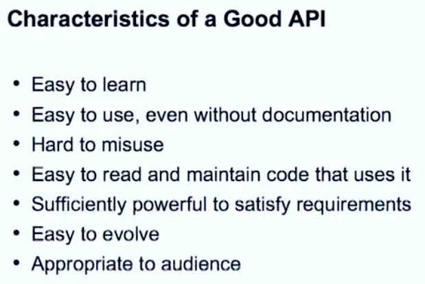

---

* 366 分布式算法\([Distributed algorithm](https://en.wikipedia.org/wiki/Distributed_algorithm)\)分类：原子提交（2PC，3PC），一致性（Paxos，Raft），分布式查找，领导选举，互斥，资源分配，复制，可靠广播，生成树等。

---

* 367 间接通信总结

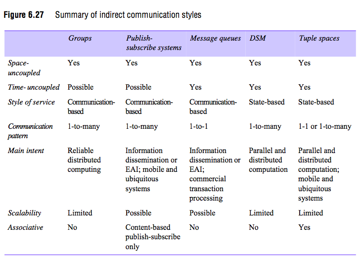

---

* 368 CAP理解：

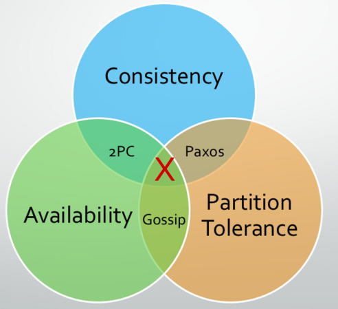

**C+A  **以2阶段提交\(2 phase commit\)为代表的严格选举协议。当通信中断时算法不具有终止性（即不具备分区容忍性）;

**C+P  **以Paxos、Raft为代表的多数派选举算法。当不可用的执行过程超过半数时，算法无法得到正确结果（即会出现不可用的情况）;

**A+P  **以Gossip协议为代表的冲突解决协议。当网络分区存在和执行过程正确时，只能等待分区消失才保持一致性（即不具备强一致性）

---

* 369 人类不可能制造永动机同样也不可能满足flp impossible或cap。cap打破了制造**超级计算机**的幻想。一台有无限存储和计算能力的“超级计算机”，可以提供无穷大的存储容量，并且可以将计算时间降低至无穷小。

---

* 370 分布式系统设计其实就是就权衡**cap**。

---

* 371 cap权衡在nosql中的应用

---

* 372 Lamport逻辑时钟（[Logical clock](https://en.wikipedia.org/wiki/Logical_clock)）不能捕获因果关系，但是向量时钟（[Vector clock](https://en.wikipedia.org/wiki/Vector_clock)）可以捕获因果关系。

---

* 373 向量时钟有可能确保所有先于某个消息的所有消息接收后才传送这个消息。

---

* 374 A distributed hash table \(DHT\) is a reliable, scalable, wide-area data storage system that frees programmers from many of the complications of building a distributed system

---

* 375  DHT不是一个算法也不是一个数据结构，而是一个解决分布式问题的一个存储系统。

---

* 376  DHT的优缺点

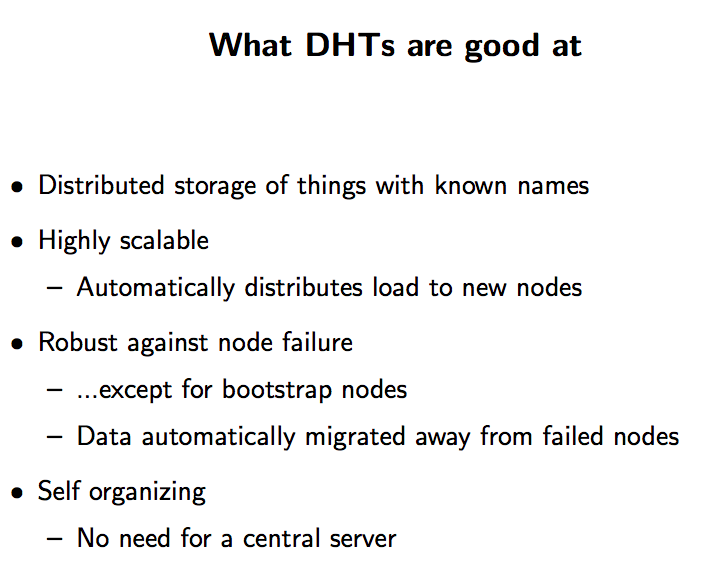

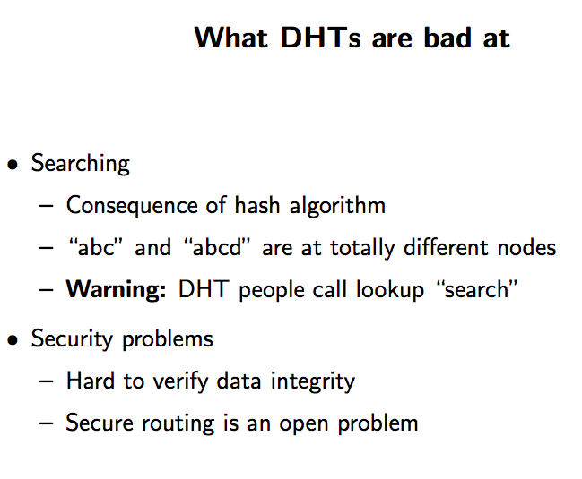

---

* 377 分布式系统和计算机网络的一个普遍问题是没有全局共享时钟。不同机器上的进程有自己的时间。

---

* 378 时钟概念理解：make程序。

---

* 379 Lamport：Happen-Before，Vector Lock，Logical Lock,Lamport TimeStamps ，Vector TimeStamps....

---

* 380 Lamport：时钟同步是可能的，但是不是必须的。如果两个进程间不进行交互，那么时钟无需同步。重要的不是所有的进程在时间上完全一致，而是他们在事件发生顺序上要达成一致。

---

* 381 互斥算法：

---

* 382 进程同步的基础问题：1  时钟   2  互斥  3 选举

---

* 383 时间，时钟，事件顺序。

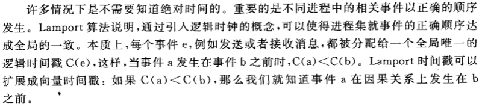

---

* 384 复制可以提高可靠性和性能，但是带来多副本间数据不一致的问题和消耗更多网络带宽。复制代价大小取决于进行一致性处理的代价。

---

* 385 一致性实现的**关键思想**：以单个**原子操作**或者**事务的形式**在所有副本上执行更新。

---

* 386 可扩展问题可以通过复制和缓存技术得到缓解，但是保持所有副本一致性通常需要全局同步，而全局同步又会带来严重的性能下降。可行的方法是放宽一致性的限制。如放松以原子操作方式执行的要求。可放宽程度取决于复制数据的访问模式和更新模式更取决于数据的用途。

---

* 389  [Mark Richards](http://www.wmrichards.com) 在software architecture patterns一书中将架构分类以及架构特点：

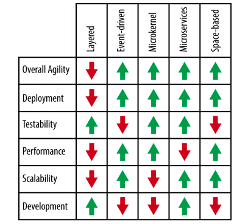

Overall Agility：整理灵活性   Deployment  部署  Testability  可测性 Performance 性能  Scalability 扩展性  Development 开发

---

* 390 常见的[编程范式](https://en.wikipedia.org/wiki/Comparison_of_programming_paradigms)：命令式，申明式，结构化，过程化，函数式，面向对象，事件驱动，基于自动机的（有限状态机）

---

* 391  没人实现Chrome浏览器使用分层架构模式，也没人实现Web网站使用微内核架构模式。但是Web框架本身可以采用插件模式。RPC框架实现用Broker模式。但是RPC本身请求过程可能是分层模式（去Db请求数据）。

---

* 392 POSA1。分类架构模式

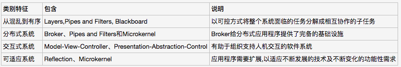

---

* 393 多副本写实现一致性：Lamport时间戳+定序器的对称多播

---

* 394 分布式系统中**向量时间戳**提供了一种表示历史记录的方法。（历史读写操作集合）

---

* 395 原子性是很多应用程序的重要特征。分布式系统（包括分布式事务）中的原子性基础是**分布式提交协议**。

---

* 396 容错的关键技术-----冗余（[Redundancy](https://en.wikipedia.org/wiki/Redundancy_%28engineering%29)）

---

* 397 分布式服务器故障模型

Arbitrary  failure 也叫 Byzantine failure。

---

* 398 CAP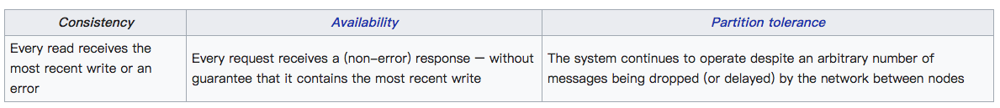

---

* 399 

---

