* 400  一致性模型：较少限制的模型比较容易使用，而带来较多限制的模型使用起来比较困难，但是容易使用的模型的执行效果不如复杂模型那样好，这就是生活。

---

* 401 开发人员为应用程序指出一致性需求但是获得这种需求可能是很困难的。开发人员往往不熟悉处理复制问题，更不要说让他们理解一致性的详细信息了，因此，编程接口必须是简单的且容易理解的。

---

* 402 冗余技术：1 信息冗余  2  时间冗余  3 物理冗余。  物理冗余是提高容错性最著名的技术。眼睛，耳朵，手，飞引擎。

电路设计的TMR-三倍模块冗余

---

* 403 [Quorum](https://en.wikipedia.org/wiki/Quorum_%28distributed_computing%29)：多数表决的一个操作是否在分布式环境中执行。可用于**提交协议**或者**复制协议**。

---

* 404 **语言的分类**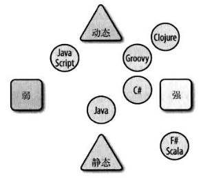@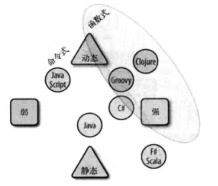

---

* 405 **多语言金字塔**  

---

* 406 编程上下文设计思路影响了开发工具：

复合型抽象：细粒度组建构成整体。Unix shell

上下文抽象：基于插件的架构。elispe，maven，ant。必须先理解上下文。

---

* 407 基于微内核的架构（也叫基于插件的体系）：Eclipse IDE和Amoeba。其他基于插件的架构：mysql引擎，hybris加速器。

---

* 408 JVM是个什么架构体系？

---

* 409 思考软件架构与业务架构：spring什么架构？网络什么架构？netty什么架构？elispeIDE什么架构？dubbo什么架构？linux内核什么架构？秒杀什么架构？平台开发什么架构？消息队列什么架构？编译器什么架构？mysql什么架构？微服务什么架构？hybris什么架构？jvm什么架构？垃圾回收器什么架构？spanner什么架构？hdfs什么架构？大数据平台什么架构？uds什么架构？word什么架构？**任何软件**均有其架构，也就是**设计思路**。

---

* 410 架构就是设计思路。设计思路就是解决系统关键的几个问题，提出关键的问题并解决就是架构。

---

* 411 设计rpc，设计rpc的框架和设计基于rpc的应用架构。第一个是设计架构的架构，第二三个是设计架构的应用。设计RPC更抽象。

---

* 412 [SPI](https://en.wikipedia.org/wiki/Service_provider_interface)在JDBC中的应用

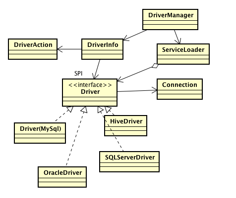

---

* 413 各种SPI机制对比

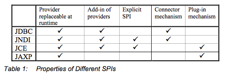

---

* 414 框架灵魂：bean之于spring，handler之于jetty，valve\(阀\)/container之于tomcat，而HSF框架本身没有灵魂。它们是面向新需求的扩展点，是框架解决变化的原则。

---

* 415 SPI

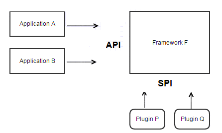

---

* 416 Cassandra设计 = Google Bigtalbe（HBase） + Amazon Dynamo，特点：分布式，无中心（对等架构，Gossip），弹性可扩展，高可用，容错，可调一致性，面向列。

---

* 417 最终一致性的“最终”一般是毫秒。

---

* 418 区块链是分布式技术的应用，一种去中心化的技术架构。

---

* 419 区块链通用架构 。POW，POS，PBFT，RAFT

---

* 420 spanner和aurora区别

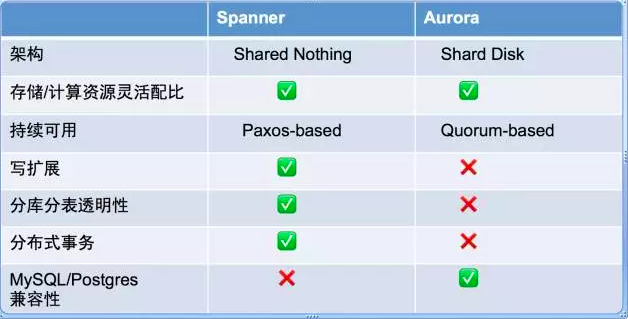

---

* 421 OLTP和OLAP区别

---

* 422 数据库对比

---

* 423 IT本质是计算。图灵机是现代计算机的理论基础。冯诺伊曼架构主导了计算机60多年的发展。宏观架构的几次变化，从最底层看，在新的场景中为突破底层冯诺伊曼的瓶颈（指令串行执行，程序和数据共享总线，计算和数据分离）在而进行的上层调整，在IT层面遇到的问题，将冯诺伊曼按照特定的协议按某种架构进行组合。以满足特定的需求。

---

* 424 分布式存储系统对比

---

* 425 可用性

---

* 426 可用性分析

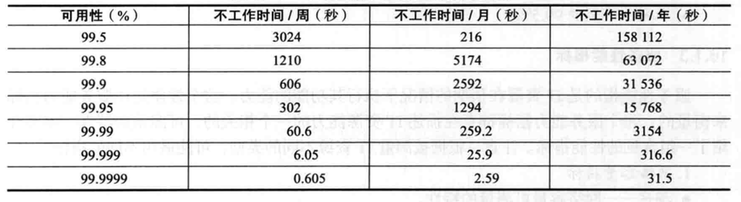

---

* 427 赵班长的缓存知识体系（[点击查看](https://www.unixhot.com/page/cache)）

---

* 428 运维知识体系（[点击查看](https://www.unixhot.com/page/ops)）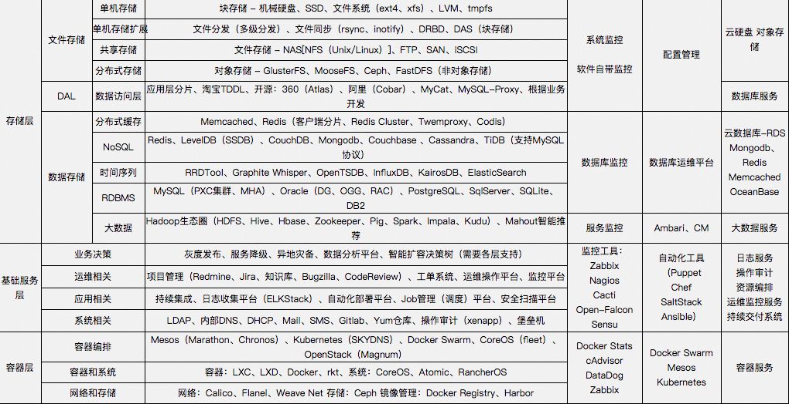

---

* 429 [分布锁](https://en.wikipedia.org/wiki/Distributed_lock_manager)兼容表

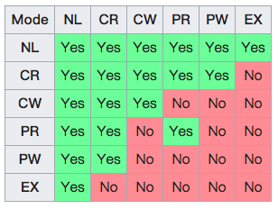

NL：Null 对资源不访问   CR/W：并发读/写   PR/W :保护性读写 Ex：互斥，独占

---

* 430 数据库锁兼容性

  

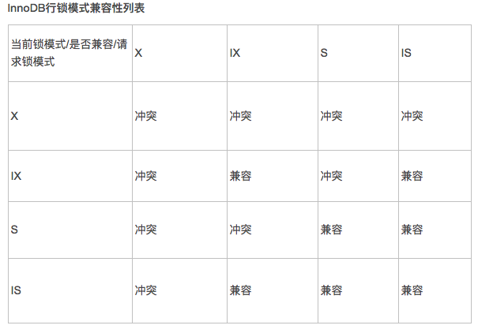

---

* 431 Oracle锁兼容性：

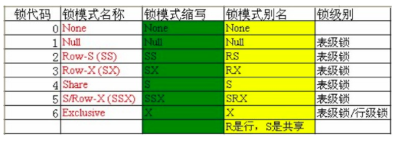

---

* 432 SqlServer锁兼容性

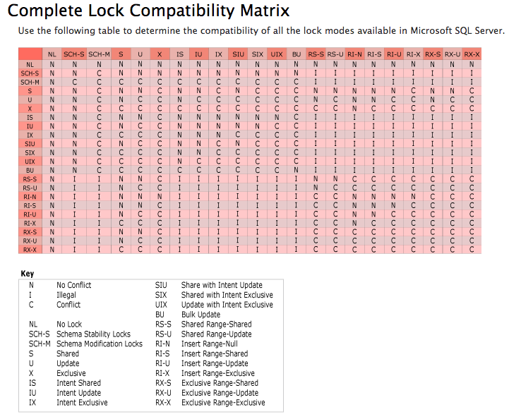

---

* 433 技术趋势

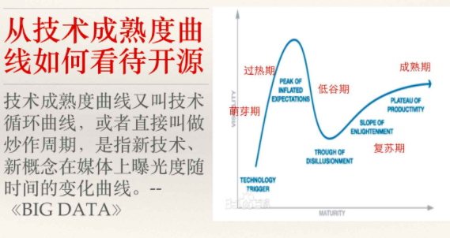

技术热点到炒作到企业产品输出。

---

* 434 进程间通信方式

---

* 435 进程间通信方法，协议，库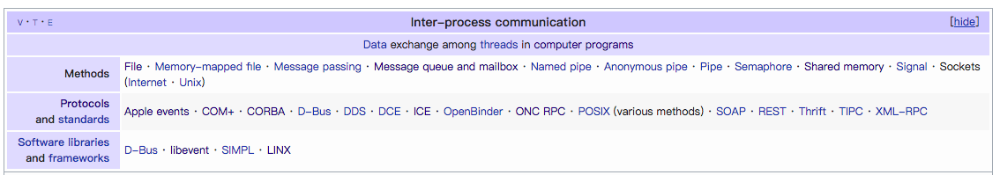

  ---

* 436  学Lisp就好比学道德经，对现在有什么作用？

---

* 437  编程本质是和计算机\(图灵机\)交流，和一种计算模型交流，编程语言只是交流途径，但是交流的思维和层次不一样。更有意思的是你在和人造的东西在交流。这种计算模型是科学的，但是又是艺术的。编译器怎么看设计模式？披着狼皮的羊而已。

---

* 438 函数式编程语言

---

* 439 大部分高级语言是[图灵等价](https://en.wikipedia.org/wiki/Turing_completeness)，或者图灵完备的。

---

* 440 解决一个困难的问题（制度化）：1使用一个强大的语言  2  为难题写一个事实解释器（跨平台的JVM）  3  自己变成难题的人肉编译器。设计模式就是人肉编译器。设计模式更多是工程范畴。

---

* 441 模式与Lisp：23种设计模式16种List语言本身已经提供了。

---

* 442 [PaulGraham](https://en.wikipedia.org/wiki/Paul_Graham_%28computer_programmer%29)谈模式：当我在自己程序中用到了模式，表明某个地方出错了，程序的形式应该仅仅反映他所解决的问题，代码其他地方外加的形式都是一个信号，说明我对问题的抽象还不够深，也经常提醒自己在手工完成的事情，本应该通过宏的扩展自动实现。

---

* 443 工具论本质在于目的大于过程，目的到达。手段无所谓。语言是工具，数据库是工具，服务器是工具，人是为了商业目的服务。不免，有些悲哀。你是生死的工具么？工具思维下越学人越变得像工具，全然失去编程的乐趣。失去了对事物本质的追寻。原理的意义也竟然丧失。

---

* 444 架构图：栈式和流式。栈式体系软件组成，流式体现软件信息流。

---

* 445 eclipse架构解析：

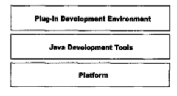

**核心运行时：**Extension Object，IAdaptable，AdapterFactories

**核心工作区：**访问文件系统资源Proxy，Bridge，工作区：Composite，遍历资源树：Visitor，跟踪资源变化：Observer，批量修改：Execute Around Method

**JavaCore：**从资源到java元素：Adapter，Java元素：Virual Proxy，Java元素树：Composite，类型体系：Objectify Assocations

，跟踪Java元素变化：Observer，收集结果：Builder，抽象语法树：Visitor

**SWT：**组合窗体组件：Composite，定义布局：Strategy，响应事件：Observer

**JFace：**Viewer：连接窗体组件和领域模型：Pluggable Adapter，动作：Command

**UI工作台：**懒加载：Virtual Proxy，持久化UI状态：Memento，工作台服务：IAdaptable

---

* 446 eclispe架构：微内核+插件

---

* 447 技术选型本质是取舍与权衡过程。对技术细节理解越深，踩坑将越少。每到一个点，就是一个取舍。不能领悟取舍，就不能领域技术精髓。

---

* 448 HashMap体现了工程取舍思维。

---

* 449 新问题有新解法，新解法又会带来新问题。

---

* 450 顺序磁盘比随机内存快？Kafka？

---

* 451 CAP在工程中的应用

---

* 452 CAP新解

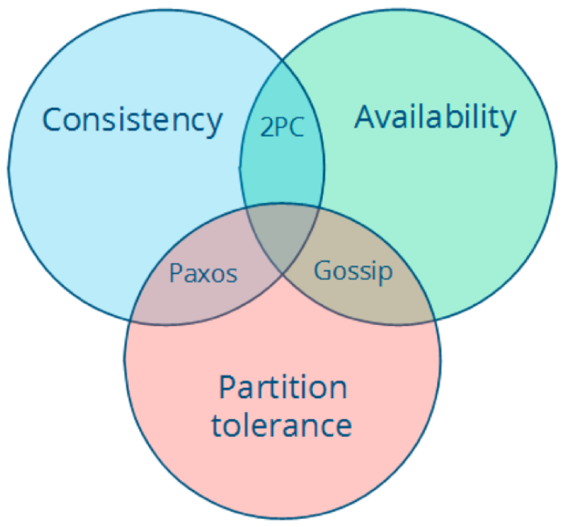

---

* 453 分布式系统[8条错误假设](https://en.wikipedia.org/wiki/Fallacies_of_distributed_computing)

* 网络是稳定的。

* 网络传输的延迟是零。

* 网络的带宽是无穷大。

* 网络是安全的。

* 网络的拓扑不会改变。

* 只有一个系统管理员。

* 传输数据的成本为零。

* 整个网络是同构的。

* [network](https://en.wikipedia.org/wiki/Computer_network) is reliable.

* [Latency](https://en.wikipedia.org/wiki/Latency_%28engineering%29) is zero.

* [Bandwidth](https://en.wikipedia.org/wiki/Throughput) is infinite.

* The network is [secure](https://en.wikipedia.org/wiki/Computer_security)

* [Topology](https://en.wikipedia.org/wiki/Network_topology) doesn't change.

* There is one [administrator](https://en.wikipedia.org/wiki/Network_administrator)

* Transport cost is zero.

* The network is homogeneous.

---

* 454 集群和容器的“[OSI模型](https://coreos.com/blog/cluster-osi-model.html)”：

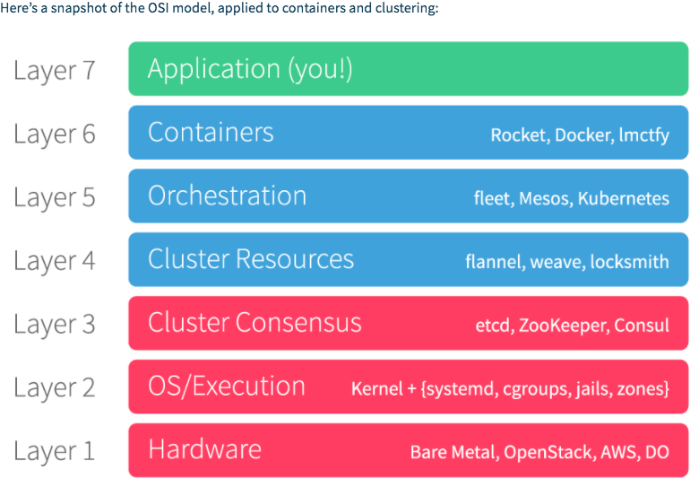

---

* 456 虚拟机：系统与进程的通用平台。

---

* 457 虚拟机多样性举例：

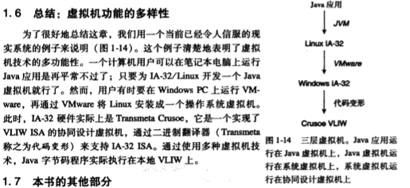

---

* 458 设计一个虚拟机[jikesrvm](http://www.jikesrvm.org/)

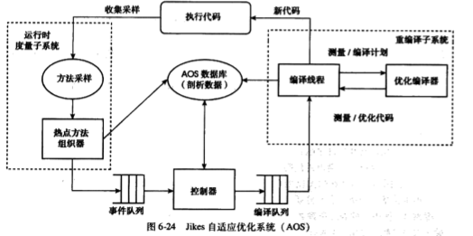

---

* 459 高级语言虚拟机的理解：

---

* 460

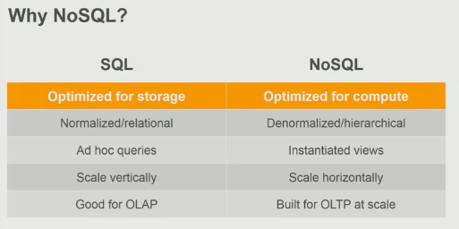

---

* 461 [Clean Architecture](https://8thlight.com/blog/uncle-bob/2012/08/13/the-clean-architecture.html)

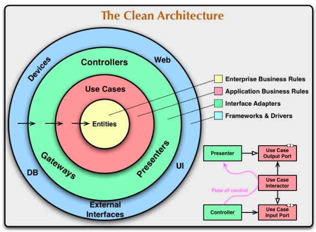

---

* 462 微服务设计模式：（[click here](http://microservices.io/patterns/index.html)）

---

* 463 CAP

---

* 464 Gabage Collector

---

* 465 编译器和解释器架构区别

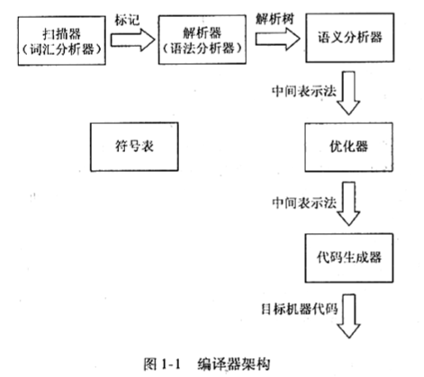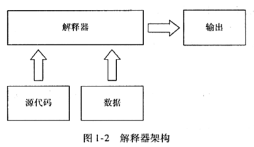

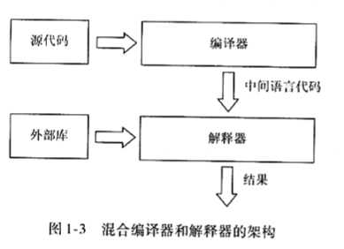

---

* 466 Java编译器和解释器模型

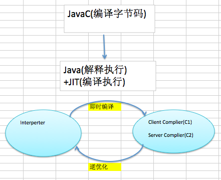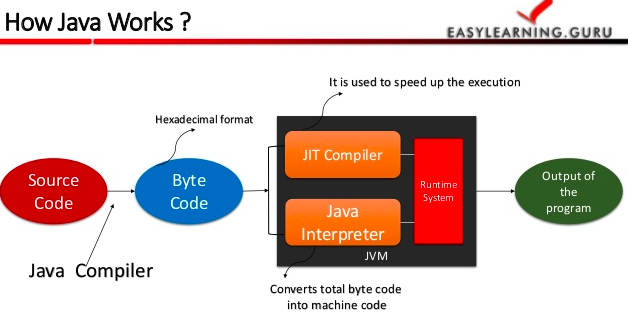

---

* 467 [JVM架构](http://www.javainterviewpoint.com/java-virtual-machine-architecture-in-java/)【**Class Loader Subsystem，Runtime Data Area，Execution Engine】**

---

* 468 Java原理两问：1 Javac HelloWrold.java 发生了什么？  2 Java HelloWorld 发生了什么 ？

---

* 469 Python解释器

---

* 470为什么Java没有eval\(\)? 如果加入？在编译时加还是运行时？

---

* 471 BSF-[Bean Scripting Framework](/Bean_Scripting_Framework)  Java调用其他语言通用框架。[Nashorn](https://en.wikipedia.org/wiki/Nashorn_%28JavaScript_engine%29)和[Rhino](https://en.wikipedia.org/wiki/Rhino_%28JavaScript_engine%29)是JDK官方实现的JS脚本引擎。[JSR223](https://www.jcp.org/en/jsr/detail?id=223)。而JPython是非官方实现的脚本引擎。[scripting-languages](/scripting-languages)，[List\_of\_JVM\_languages](https://en.wikipedia.org/wiki/List_of_JVM_languages)，[jvm-languages](http://mvnrepository.com/open-source/jvm-languages)
  

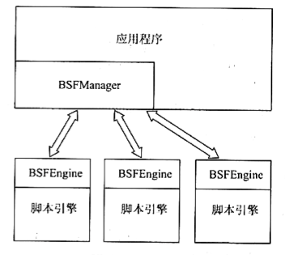

---

* 472 [开源协议](https://en.wikipedia.org/wiki/Comparison_of_free_and_open-source_software_licenses)

---

* 473 [Apache Harmony](https://en.wikipedia.org/wiki/Apache_Harmony)

---

* 474  Dynamic Runtime Layer Virtual Machine（DRLVM）架构图

---

* 475  JavaVm 和 DRLVM架构区别是什么？

---

* 476 MediaWik架构图

---

* 477  架构：The fundamental organization of a system, embodied in its **components**, their **relationships** to each other and the environment, and the **principles** governing its design and evolution. IEEE定义[ISO/IEC\_42010  ](https://en.wikipedia.org/wiki/ISO/IEC_42010)[IEEE\_1471](https://en.wikipedia.org/wiki/IEEE_1471)

---

* 478 [Enterprise architecture framework](https://en.wikipedia.org/wiki/Enterprise_architecture_framework)（企业应用框架）：[TOGAF](https://en.wikipedia.org/wiki/The_Open_Group_Architecture_Framework)等

---

* 479 TOGAF体系

## 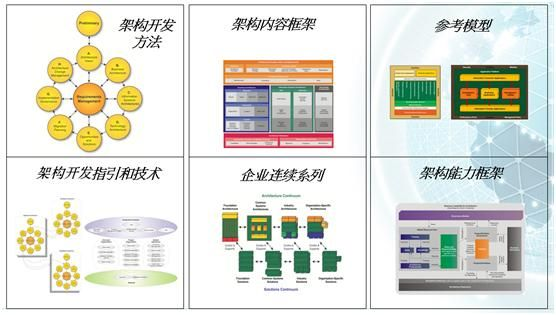

---

* 479 计算模型的演进

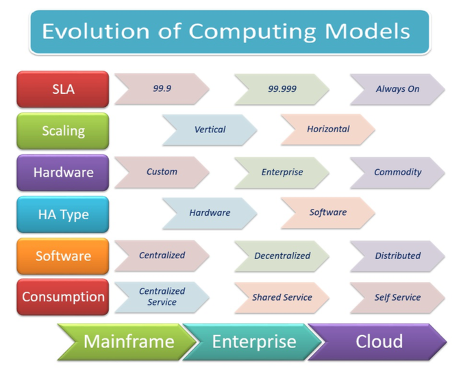

---

* 480 理解语言分类\([Understanding the Taxonomy of Languages](http://www.catb.org/esr/writings/taoup/html/ch08s01.html)\)

\

从平坦到结构化，

---

* 481 开源流计算引擎

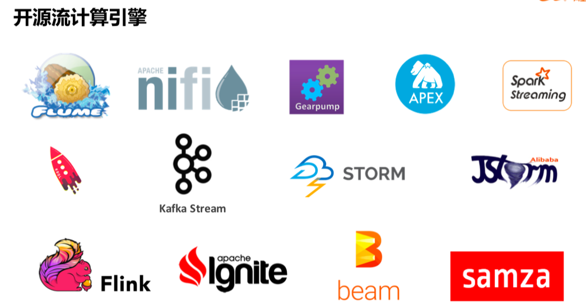

---

* 482  Unix代表一种文化，一种现象，一种人类思维，这种文化和禅宗有点像。它代表这一种思想体系，在这种思想体系下诞生的语言，工具，生态无不体现出这种哲学思想。

---

* 483 计算机领域经典的，思想几乎前人已经思考过了。伟大的思想诞生与哪里？

---

* 484  历史告诉我们一门学科的巅峰水平在其开始时候，会出现一个集大成者。其他后来者仅仅对其思想进行衍生或者补充。后世能有超越老子思想的人么？Unix编程艺术便是对历史的追溯和基本问题的重新思考。

---

* 485 It产业技术日新月异，然而在这其中，真正称得上伟大的东西寥寥无几。

---

* 486 软件世界的爱迪生：Bill Joy：发明了BSD，TCPIp,csh,vi,nfs

---

* 487 【C语言造就的Unix】是其他后续语言和工具和设计的思想的重要来源。

---

* 488 摘抄一段话：

伟大思想是什么？计算机体系伟大思想：缓存。  计算机软件伟大发明：Web，Lisp，Hash，Linux等等。

---

* 489 正则表达式引擎分类和[比较](https://en.wikipedia.org/wiki/Comparison_of_regular_expression_engines)：

---

* 490 [Douglas McIlroy](https://en.wikipedia.org/wiki/Douglas_McIlroy)经典语录：

"Those types are not "abstract"; they are as real as int and float."

"As a programmer, it is your job to put yourself out of business. What you do today can be automated tomorrow."

"Keep it simple, make it general, and make it intelligible."

"The real hero of programming is the one who writes negative code."

---

* 491 面向问题抽象。面向底层具体。

---

* 492 要学习计算机名言。

---

* 493 DB发展：【From TiDB】

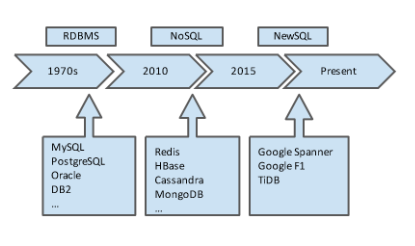

---

* 494 Java安全策略：（From：Java安全第二版）

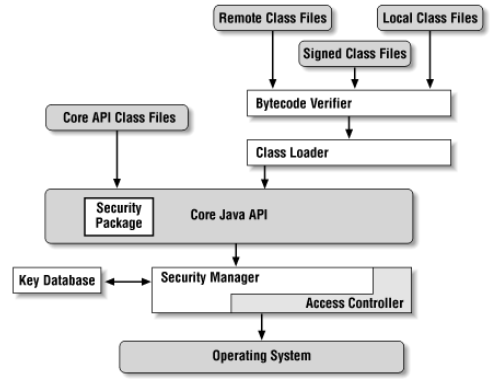

---

* 495 Domain-specific language \(noun\): 一种专注于某一领域，仅针对部分表达方式的计算机编程语言。

---

* 496 字节码校验器\([定理证明机](https://en.wikipedia.org/wiki/Automated_theorem_proving)\)：

---

* 497 安全管理器存取控制器关系：

---

* 498 安全管理器作用域（详见源码）

---

* 499  理解权限继承体系：

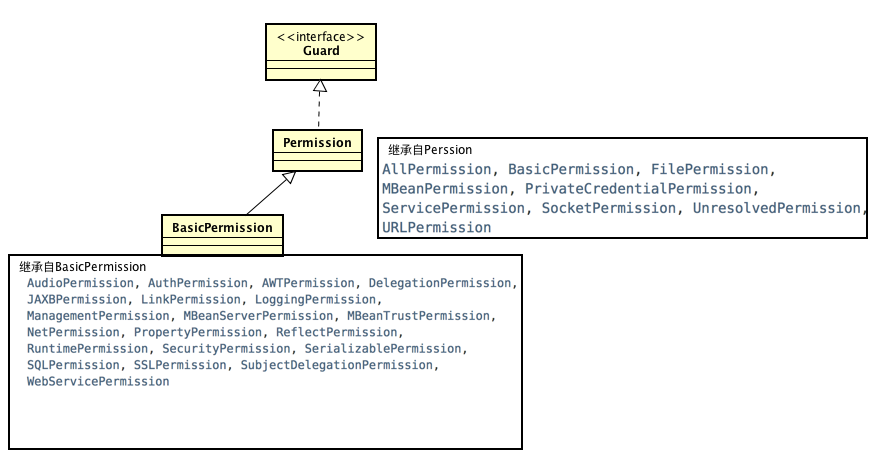

---

* 500 double-check idiom在jdk源码中在：Policy.getPolicyNoCheck\(\)

  



