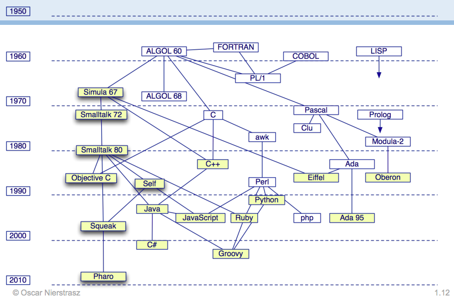
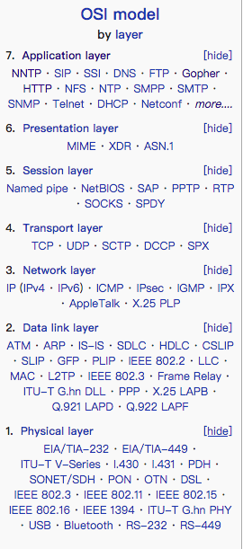
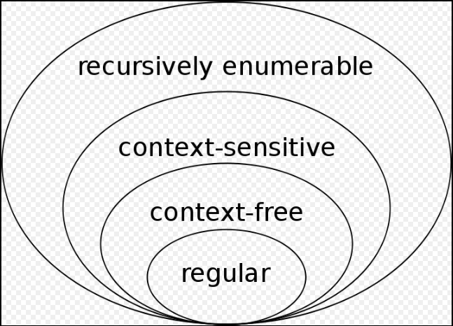
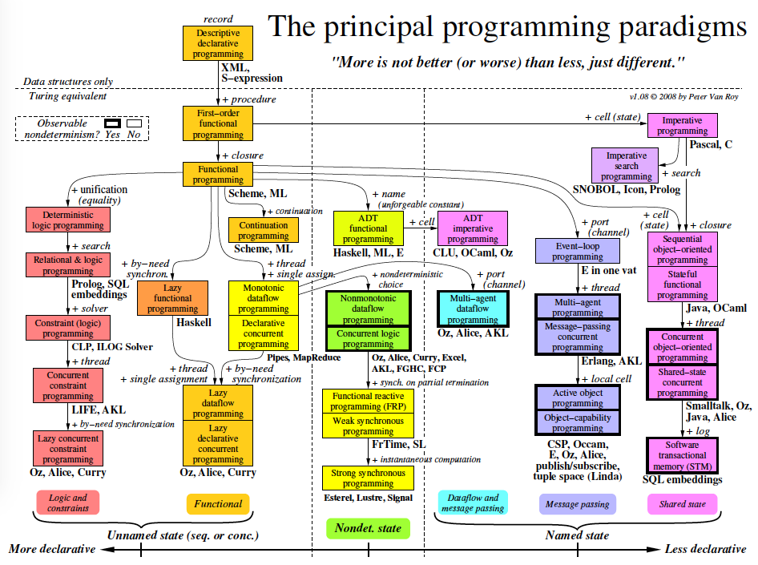
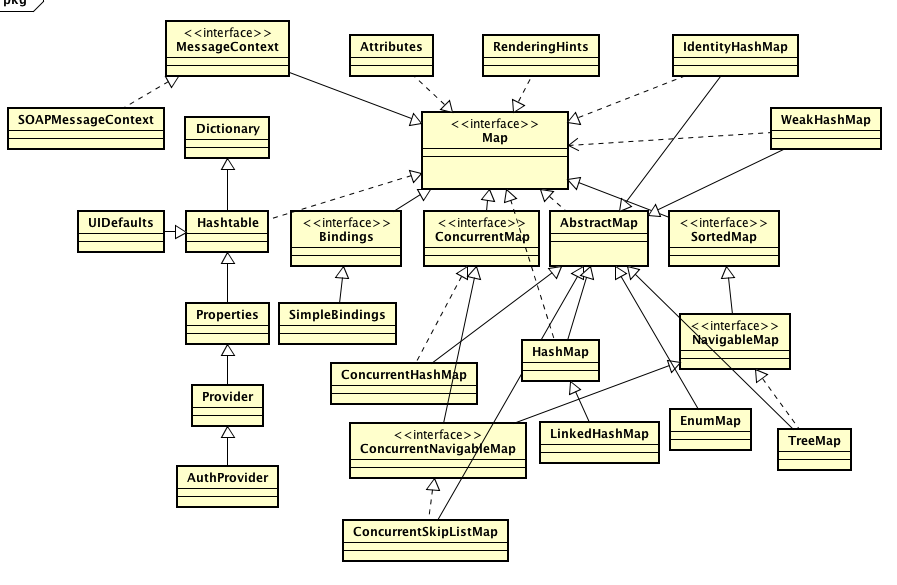
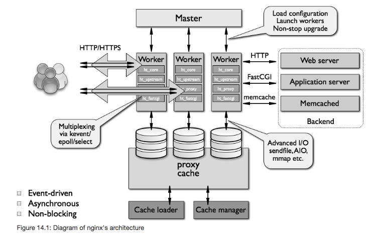
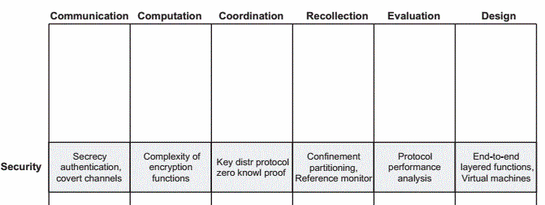
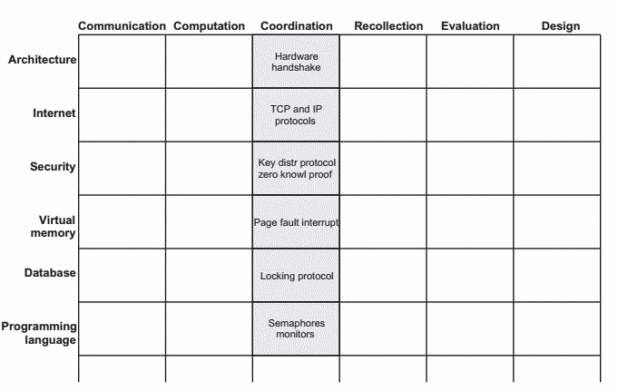

* 601 Java安全模型在于：沙箱。其思想在于：给你的程序一个可以"玩"（运行环境）的地方和玩的“玩具”（可以存取的系统资源）。

---

* 602 Java安全保证策略：类加载器，安全管理器，存取控制器，这三点构成了Java的沙箱体系。

---

* 603 理解Java安全：Platform Security，Cryptography，Authentication and Access Control，Secure Communications，Public Key Infrastructure \(PKI\)

Platform Security：Strong data typing，Automatic memory management，Bytecode verification，Secure class loading

---

* 604 Object的闭包传递-This process of loading and discovery can execute iteratively until a stable set of types is reached. This is called the “transitive closure” of the original type that was loaded.

（Java In a Nutshell-Chapter11）

---

* 605 比较三语言：

---

* 606 语言简史

---

* 607 [网络协议](https://en.wikipedia.org/wiki/List_of_network_protocols_%28OSI_model%29)
* 

---

* 608 [语言发展史](https://en.wikipedia.org/wiki/Timeline_of_computing)

---

* 609 操作系统发展史

---

* 610 硬件处理器发展史

---

* 611 [自动机理论](https://en.wikipedia.org/wiki/Automata_theory)

---

* 612   [Chomsky\_hierarchy   ](https://en.wikipedia.org/wiki/Chomsky_hierarchy)[乔姆斯基层次结构](https://baike.baidu.com/item/乔姆斯基层次结构)

---

* 613  词法分析和自动机理论

---

* 614 编程范式的演进：

---

* 615  Java线程池拒绝策略：

---

* 616 Map接口

---

* 617 Queue

---

* 618 List

---

* 619 Set

---

* 620  [http://falkhausen.de/Java-8/java.util/Collection-Hierarchy.html](http://falkhausen.de/Java-8/java.util/Collection-Hierarchy.html)

---

* 621 [Map](http://falkhausen.de/Java-8/java.util/Map-Hierarchy.html)

---

622 [Channel](http://falkhausen.de/Java-8/java.nio/channels/Channel-Hierarchy.html)

---

* 623 Ngnix架构

from  [here](http://www.aosabook.org/en/nginx.html)

---

* 624 libevent的评估标准：

---

* 625 问一个软件的性能，需要问评估标准是什么。吞吐量和时延是什么的变量，什么是限制条件。

---

* 626 jim gray:虚拟内存是一个难以置信的好的创意，局部性则是一种深刻的原理。避免原理和创意混淆。

---

* 672 计算基本6大原理：通信，计算，记忆，协作，评估，设计。

---

* 673 领域与原理的矩阵图：

---

* 674 原理+实践催生领域。

---

