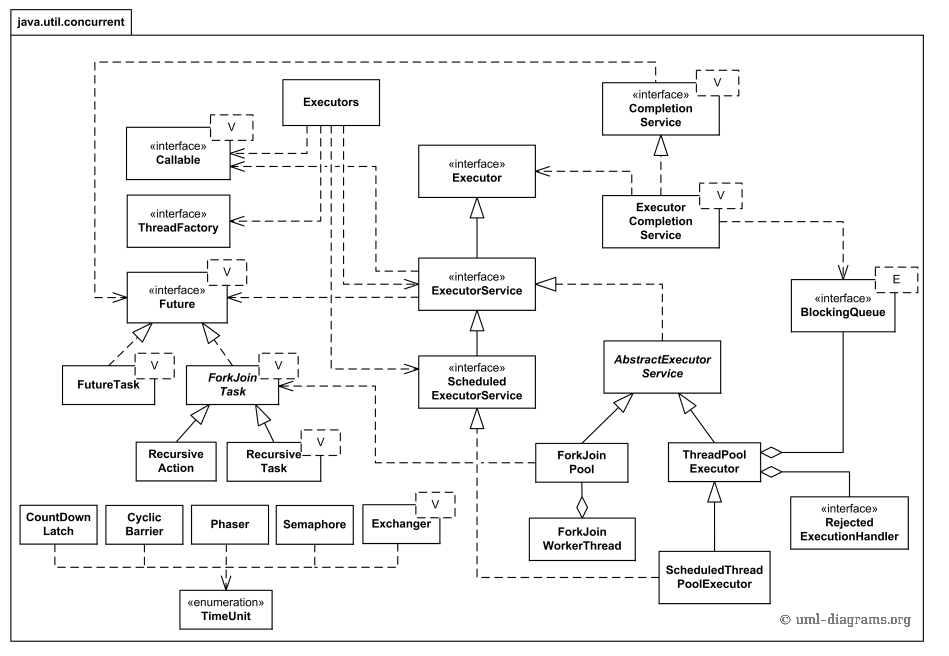
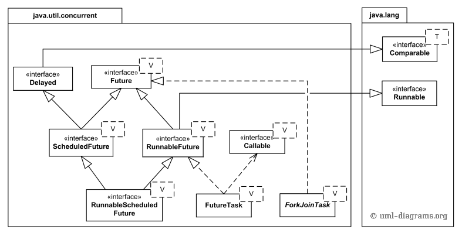
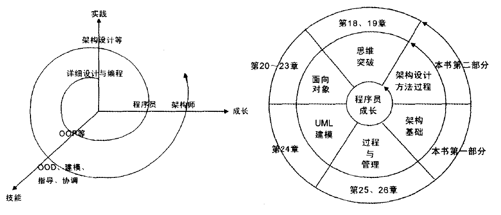
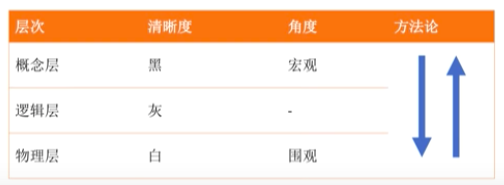
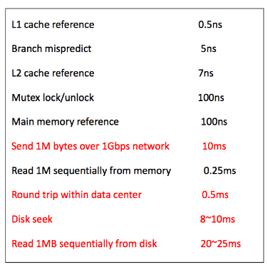
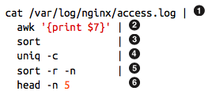
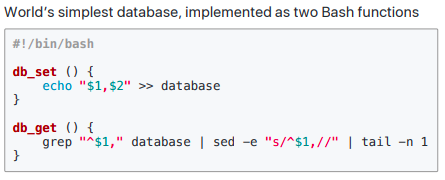
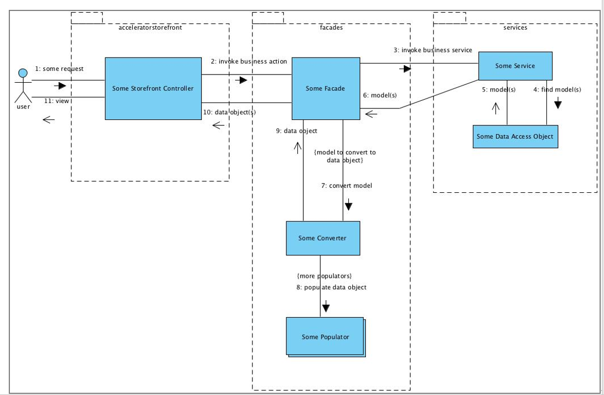

* ```
  700 PThreads是标准，LinuxThreads和NPTL是linux下的实现。NPTL为了解决LinuxThreads下的问题。
  ```

---

* 701 [异步IO](https://en.wikipedia.org/wiki/Asynchronous_I/O)

|  | **Blocking** | **No-Blocking** |
| :--- | :--- | :--- |
| **Synchronous** | write,read | write,read\(select/poll\) |
| **Asynchronous** | - | aio\_write,aio\_read |

---

* 702 异步IO实现：

**问题：**异步IO

**原理：**[EventLoop](https://en.wikipedia.org/wiki/Event_loop)

**机制：**[epoll](http://www.kernel.org/doc/man-pages/online/pages/man4/epoll.4.html)\(Linux\)，[kqueue](http://en.wikipedia.org/wiki/Kqueue)\(FreeBSD, NetBSD, OpenBSD, Darwin\) ， [/dev/poll](http://developers.sun.com/solaris/articles/polling_efficient.html)\(Solaris, HPUX\)，[pollset](http://www.ibm.com/developerworks/aix/library/au-pollset/index.html)\(AIX\)，[Event Completion](http://developers.sun.com/solaris/articles/event_completion.html)\(Solaris 10\)，[I/O Completion Ports](http://msdn.microsoft.com/en-us/library/aa365198%28VS.85%29.aspx)（IOCP-Windows），event ports（SunOS）

**实现库：**libev（select, poll, epoll, kqueue and event ports backends）

libevent（[/dev/poll](https://en.wikipedia.org/w/index.php?title=/dev/poll&action=edit&redlink=1),[kqueue\(2\)](https://en.wikipedia.org/wiki/Kqueue),POSIX [select\(2\)](https://en.wikipedia.org/wiki/Select_%28Unix%29),Windows [IOCP](https://en.wikipedia.org/wiki/Input/output_completion_port),[poll\(2\)](https://en.wikipedia.org/w/index.php?title=Poll%282%29&action=edit&redlink=1),[epoll\(4\)](https://en.wikipedia.org/wiki/Epoll) and [Solaris](https://en.wikipedia.org/wiki/Solaris_%28operating_system%29)[event ports](https://en.wikipedia.org/w/index.php?title=Event_port&action=edit&redlink=1)）。

libuv（event-driven asynchronous I/O model——Full-featured event loop backed by epoll, kqueue, IOCP, event ports.）

---

* 703 C10K问题经典文章 [C10K](http://www.kegel.com/c10k.html)

---

* 704  NodeJS = GoogleV8 + Libuv，单线程，非阻塞IO

---

* 705 NGNIX的[连接处理方法](http://nginx.org/en/docs/events.html)：select,poll,kqueue,epoll,/dev/poll,eventport

---

* 706 [juc架构](https://www.uml-diagrams.org/java-7-concurrent-uml-class-diagram-example.html)

任务执行框架：

并发集合框架

任务种类框架



---

* 707 程序设计是精确地艺术，也是模糊的艺术。精确到一个字节的控制，也可以模糊到一张架构图。

---

* 708 对专业领域永远保持好奇心和谦卑之心。

---

* 709 一个程序使用另一个程序的三种方法：[static linking](https://en.wikipedia.org/wiki/Static_linking)，[dynamic linking](https://en.wikipedia.org/wiki/Dynamic_linking)，[Dynamic loading](https://en.wikipedia.org/wiki/Dynamic_loading)
    
* classloader本质是运行时候使用其他程序的class文件的一种方法，动态代理发生在反射和类加载时候。静态代理有点类似于c中的静态链接库。

---

* 710 IPC方法大全：


---

* 711  虚拟机类型：

---

* 712 项目架构和项目框架区别：


讲项目用的框架简单，但是讲清架构不容易。面试者将项目时候容易将项目用了XXX技术，其实是在讲Framework，而不是Architecture。

框架是是一种特殊的软件，软件设计的半成品，是解决方案的提供者。而架构是软件设计的重要决策。架构决策往往会体现在框架中。

---

* 713 框架是软件，架构不是软件。

---

* 714 架构关注：拆分系统组件\(分离关注点\)+组件间**静态结构**关系+组件间**动态交互**关系。

---

* 715  redis senitnel：raft leader协议选主    redis cluster：raftleader协议选主，gossip传播更新。

---

* 716 Framework：


Architecture：


---

* 717 Grady Booch说：“设计软件系统中的**重要协作**是设计阶段架构设计师的主要活动。这些协作表示出了**架构的精髓**……”

---

* 718  Ivar Jacobson说：“接口是架构的核心。” -  协作将涉及到接口

---

* 719 库lib，框架framework，模式pattern，组件componment，架构Architecture之间的关系。框架从软件中ioc解耦了，而模式应用于库，框架，组件，架构所有里面，框架是特殊的软件。

---

* 720 技术变现能力？你怎么评估自己的水平？什么叫初中高级Java？阿里体系内做出的软件是什么？大概就那样么？看书的目的是什么？- 探索领域。技术变现能力？简单的模板来挑出合适的人选？

---

* 721 测试视角：好的软件基本就是:：能用。

---

* 722 阿里体系下的软件是什么样子的？另一种生存：**观察，观察，在观察。**

---

* 723 成长维度也就是变化的维度：1   知识的深与广谈自我积累   2 项目维度谈贡献  3  产品和解决方案谈架构  4 业务谈生存额发展  5 思维谈未来，其中**思维提升**最难。

---

* 724 不学习无法成长。学习什么成长最快？

---

* 725 温昱的程序员成长模型：

---

* 726 超越软件架构：创建与维护优秀解决方案。很多优秀书籍谈软件架构，以及如何选择架构，这些书可以帮助建立成功的架构，但是却不能帮助建立优秀的解决方案。

---

* 727 认识提升：domo：自动化运维平台，微服务治理平台，监控平台，稳定性平台

  console：核心业务平台，对外输出能力体现，运营能力的体现

  所有组件：微服务架构设计，组件与组件间交互才是核心，具体代码编写倒是次要。编写异常反而成为了写代码最需要考虑的地方。

产品维度看私有云方案是特定领域的解决方案。

---

* 728 从单机到多机，从集中式到分布式，所面临问题相似，根据所处层次而导致解决方案不同。业务组件从单机到多机，redis从单机到多机，mysql从单机到多机，整理与归纳这些组件在分布式时候的特性。如何做复制，如何保证数据一致性，如何做高可用，如何保证性能，如何进行扩展？以**组件**的角度看所有软件。而非以**软件**看软件？。

---

* 729 高可用与伸缩性解决方案：


---

* 730 从功能-》框架-》组件-》架构-》平台的进化。平台促进业务，业务发展平台。

---

* 731 云计算的服务模式：Iaas，Paas，Saas。这对于一个商业软件公司实现其产品提供了思路。也是一个公司设计师构建其**软件资产**需要考虑的问题。小公司缺乏平台设计与运营能力。

---

* 732 深入业务对于开发来说是一种选择，更是一种眼光。

---

* 733 技术人员要走出对技术的痴迷，把眼光放长远，从细节上了解什么可行，什么不可行，但是必须同时立足市场，熟知业务，知道企业战略，目标以及问题。

---

* 734 对问题理解越深。越能在另外一种场景下灵活应用。

---

* 735 设计平台，大公司玩法，用框架解决问题，小公司玩法。

---

* 736 理解自己正在做的东西到底是什么？

---

* 737 《软件开发本质论》

* Talk is cheap, show me the values.  价值

* Talk is cheap, show me the features.  团队

* Talk is cheap, show me the deliverables. 产品

* Talk is cheap, show me the codes.  开发

* Talk is cheap， show me the tests.   测试

---

* 738 在架构层面：数据库只是实现细节，应用程序程序框架只是实现细节，web是实现细节。

---

* 739 只有一种分布式事务算法：**2PC**，其余均是变种。只有一种一致性算法：**Paxos**，其余均是变种。

---

* 740 学术和工程的区别：学术提供抽象模型，工程提供实现细节。

---

* 741 Linux中抽象：everything is file，common file interface \(类似io\)，pipe

---

* 742 算法决定底线，系统设计决定上限，领域知识决定整体的知识架构。

---

* 743 [系统设计](https://en.wikipedia.org/wiki/Systems_design)：**Systems design **is the process of defining the **architecture**, **modules**, **interfaces**, and **data**  for a system  to satisfy specified **requirements**  （架构，模块，接口，数据存储，特定需求），虽然需求在最后，但是必须第一考虑。

---

* 744 系统设计的snaker\(舞蛇人\)原则\(宏观与微观\)：

Scenario\(场景\):用例和接口

Necessary\(限制\):需求和假设：性能估算\(disk,io,cpu,lantency,throughput\)

Application\(应用\):服务和算法

Kilobit\(数据\):数据

Evolve\(演化\): 性能,扩展,鲁棒,性能估算

Result\(结果\): 业界存在方案，日志\(elk，flume，kafka+hbase\)



舞蛇人意味着系统设计很凶险，艰难险阻很多，掌握蛇要打七寸，抓住关键问题。

---

* 745 常见系统设计题目：

* **基础设施：**design file system，design rate limter,design monitor system,design log colection，design cache，design big data platform,design tiny url, design database, design os, design kv store， design a gateway，design a Garbage Collection System，

* **中间件：**design rpc\(high performace\) framework, design mq, design mysql proxy,design sharding sharding proxy,design a lib,design web crawler,

* **领域业务：**design google search,design youtube,design netflix,design facebook, design linkedIn,design uber, design recommender system, design wechat,design hit counter, design e-Commerce website

---

* 746 系统设计1问题和2储备。


---

* 747 另一种系统设计思路（自底向上）：

* requirements clarification: design fb messenger:push notifications,group chat,attchments,text chat

* system interface definition:SendMessage\(from\__user, to_\_user,message, ...\)

* back-of-the-envelope estimation:how many qps\(read or write?\):how much disk storage or memory is needed?

* design data model:er diagram

* high-level design

* compoent design

---

* 748 性能基准数据：**对基础数据要敏感**。




---

* 749 学会抽象一个技术的最简单模型：mongodb，lsm-tree，map-reduce，gfs，bigtable

map-reduce的实现：

mongodb实现：从文件系统实现，逐渐加功能，

你看到的mongodb之所以复杂，因为是最终成品，包含了大量优化和工程考虑。切记：存储系统都是从文件系统演化而来的。

---

* 750 世界上最简单的数据库：




从这种设计带来的启发：在复杂的事物其基础模型可能真的很简单。正如阴阳造就万物。

---

* 751 读写性能：随机，顺序，范围，查找和排序

---

* 752 clean architecture:设计原则

**类**层设计原则：SRP,OCP,LSP,IPS,DIP

**组件**层设计原则：组件内：REP,CCP,CRP  组件间：ADP,SDP,ADP

---

* 753  软件架构本质规划如何将系统划分成组件，并安排组件间的排列关系，以及组件间互相通信的方式。架构目的更好的对这些组件进行研发，部署，运行和维护。

---

* 754 软件架构终极目的最大化程序员生产力同时最小化系统总运营成本。

---

* 755  软件架构设计最高优先级部署使得系统正常工作这是种不正确的说法，运行时只是一小部分。软件架构的质量与能否正常工作的关系并不大。

---

* 756 Bob大叔系列：


---

* 757   一个良好的架构设计应该围绕用例来展开，这样的架构设计可以脱离框架，工具以及使用环境下完整的描述用例。并且尽可能的允许用户推迟或者延后决定使用什么框架，数据库以及web，框架应该是一个可选项。

---

* 758 良好的架构设计只应该关注用例，而把其他因素隔离开。避免让框架主导我们的架构设计。

---

* 759  Web不是一种架构，而是一种交付手段。

---

* 760 REP.CCP.CRP之间的权衡


---

* 761 只实现功能不难，高性能，低成本，高可用，高可运维，高灵活性很难，在线量每提升一个量级，技术难度也提高一个量级。

---

* 762 评估技术水平：hold多少并发，多少qps，多少用户。尽量以量化的角度去评估。

---

* 763 十万，百万：高性能，7\*24小时i连续服务。  千万：高可用，高可运维。亿级：高性能，高可用，高可运维，高灵活性。

---

* 764 技术栈!=技术能力。使用了redis和使用redis hold住多少请求是完全两个问题。

---

* 765 互联网架构模板-李运华：


---

* 766  如果你不懂google系列的paper的话，对DB的理解落后于时代10年。

---

* 767 即使应用程序所使用的数据系统提供了比较强的安全属性，也不意味着应用程序就没有一定数据损坏与丢失。\(程序bug，人为操作，故意插入重复的，删库\)，数据系统降低了高层出现问题的可能性。

---

* 768 why使用mq？ 1  两个系统处理速度不一样    2   正确性不取决于发送者是否等待消息  3  bounded buffer数据结构

---

* 769 系统模型采用**二元法**处理故障：假设有些事情可能发生，有些事情不会发生。如果有足够多设备来运行你的软件，即使再不可能的事也有可能发生。成熟系统同样UI考虑不太可能出错的可能性，并且主动管理这些风险。HDFS和AmazonS3不完全信任磁盘。所以**信任但要确认**。

---

* 770 软件开发重要的能力是设计能力。

---

* 771 工作内容：产品设计，系统设计，软件设计，编码实现，测试，部署，运维。这些工作中，什么是最核心的？从业务的角度看**产品设计**和**系统设计**是最核心的，编码实现则更像某种翻译工作。因此，我们得到第二个有关研发的事实：
  **软件研发本质上是设计，**如果我们将产品设计的工作交给TPM（类似产品经理）或者PM（业务人员），我们可以将这个事实针对研发人员进行改写：**软件研发能力最关键的是设计能力**

---

* 772 软件开发两个事实：1 **软件研发本质上是一个学习的过程，研发要有快速学习能力。**2  **软件研发本质上是设计，软件研发能力最关键的是设计能力**

---

* 773 SDE：Someone Do Everything。

---

* 774  Amazon：人人都是架构师。

---

* 775 计算机三大系统软件：数据库，操作系统，编译器。

---

* 776 软件开发基础知识应该是：熟悉三大系统软件和网络，泛语言编程。而不是和具体的语言挂钩。Java开发者狭义的基础是什么，广义的基础是什么？

---

* 777 技术是为业务服务，技术只是工具，仔细想想，也就是如此。但是怎么用工具就是问题了。

---

* 778 多积累线上处理问题经验。

---

* 779 crud没有技术含量的确如此，但是写出没有bug的crud你试试？多少次错误都在粗心大意。

---

* 780 monitor=Log\(ELK\)+Metrics\(Prometheus\)+Graph\(Grafana\)

---

* 781   every day source code，every weekly translate， every month small progress。

---

* 782 深入理解JVM的每章经典\(颇值得玩味\)：

```
世界上没有完美的程序，但是我们不应该沮丧，因为写程序本身就是一个不断追求完美的过程。
Java和C++之间有一堵内存动态分配和垃圾收集技术所围成的高墙，墙外面的人想进去，墙里面的人想出来。
代码编译的结果从本地机器码转变为字节码，是存储格式发展的一小步，却是编程语言发展的一大步。
从计算机程序出现的第一天，对效率追求就是程序天生的坚定信仰，这个过程犹如一场没有终点，永不停歇的F1方程式竞赛，程序员是车手，技术平台则是在赛道上飞驰的赛车。
并发处理的广泛应用是使得Amdahl定律代替摩尔定律成为计算机性能发展源动力的根本原因，也是人类压榨计算机运算能力的最有力武器。
```

---

* 783 不断学习不一定能到达优秀或者卓越，但是可以避免低水平。

---

* 784  业务逻辑和实现关系:业务逻辑很简单，实现很难，业务逻辑复杂，实现很简单。业务逻辑简单，实现简单，业务逻辑复杂，实现也复杂，我们需要做到，业务逻辑复杂，实现却简单。

---

* 785  保证数据一致性有DB(三大完整性约束)来做还是业务层(关联Update)来做？

---

* 786 Data Access 由DB来做还是业务层来做？(性能，分布式，可维护性，内存，CPU，是不是强业务逻辑轻数据访问等角度考虑，没有固定答案) ，有时候更愿意相信数据库，而不是程序员。

---

* 787 Hybris Request Model:



---

* 789 程序代码重复是造成Bug重大原因之一。因为重复会造成耦合。

---

* 790 重构前先写一个单元测试，就知道如何重构了。

---

* 791 代码任何地方都可以抽象，只是必要性而已。我们很多时候做的事情无非是消除重复，软件工程追求目标之一也是复用性。重构的很多时候也仅仅是消除重复。

---

* 792 数据结构，算法，系统设计(WEB,大数据)。

---

* 793 封装，复用体现了一家软件公司的工程化水平。

---

* 794 看一家公司使用某中间件的深入和认知，取决于对其进行了哪些封装，复用，创新。比如Redis和Cache。

---

* 795 GO=C+Python

---

* 796 Go:不要使用共享数据来通信，而是使用通信共享数据。

---

* 797 重入锁：已经锁上的再次上锁

---

* 790 GO:通信来建立并发程序(通信并发) JAVA:共享数据建立并发程序(共享并发)

---

* 791 “计算机科学只存在两个难题：缓存失效和命名。” — Phil KarIton

---

* 792 如何重构超级大的一个Controller？？？先写Service，然后加单元测试，拆分Service，消除重复。
    如何重构一个超级大的Service？？？先写单元测试，拆分Service。找到粒度最小的服务。  
---

* 793 Spring 配置=代码，配置的重复就是代码的重复

---

* 794 微服务不等于SpringBoot，正交性的服务本身就是微服务。

---

* 795 重复对自然来说是本能，对代码却是万恶的来源。

---

* 796 Java并发提供了三个核心抽象概念(任务，任务提交，任务执行)，具体来说：1 任务，从Runnable，Callable，FutureTask，到ForkJoinTask 2 任务提交 ExecutorService，实现submit，invoke方法，核心子类：AbstractExecutorService作为骨架实现 3 是任务执行Executor，核心子类ThreadPoolExecutor(核心方法execute)，ForkjoinPool(因为重写了提交机制，所以核心方法submit和execute)，纯接口包含了命令模式，模板模式，状态机模式等等。这就意味着你可以自定义提交和执行机制。体现了多种策略和实现分别，非常漂亮。

---

* 797 ExecutorService#submit 提交的是FutureTask，返回的也是FutureTask，FutureTask对Runnable和Callable进行了封装，使得任务有了状态，可以判断是否结束，
可以取消任务。

---

* 798 框架和人一样，都是有等级和灵魂之分的，行尸走肉和富有灵魂和激情的人，完全不一样。Spring框架的灵魂在于Bean，Junit灵魂在于Tester,Suitcase,Runner. Tomcat在于Container,Pipeline,Valve.
 .灵魂的含义是有一致性，强有力的概念，最核心的概念，是框架创造的概念。

---

* 799 写Java程序的只有读过Effectvie Java的和没有读过的。
 
---