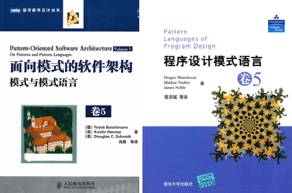
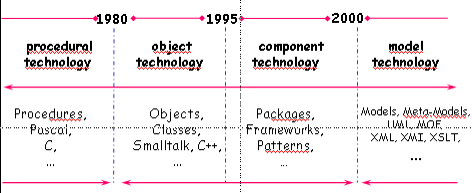
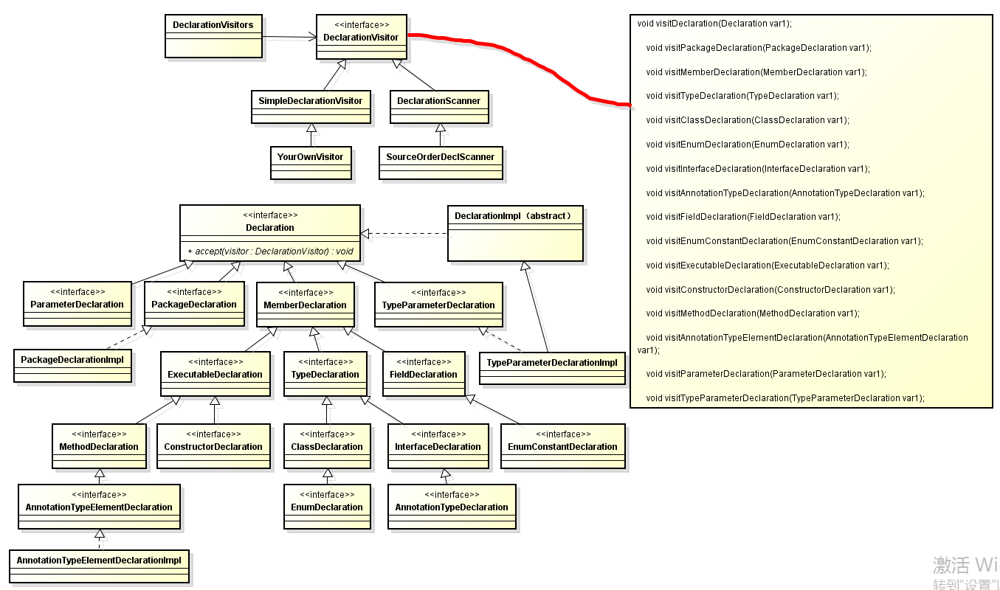
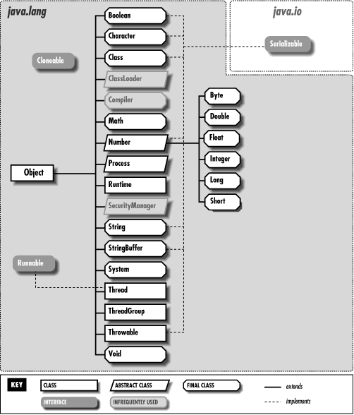
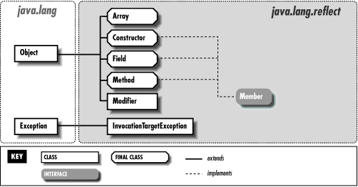
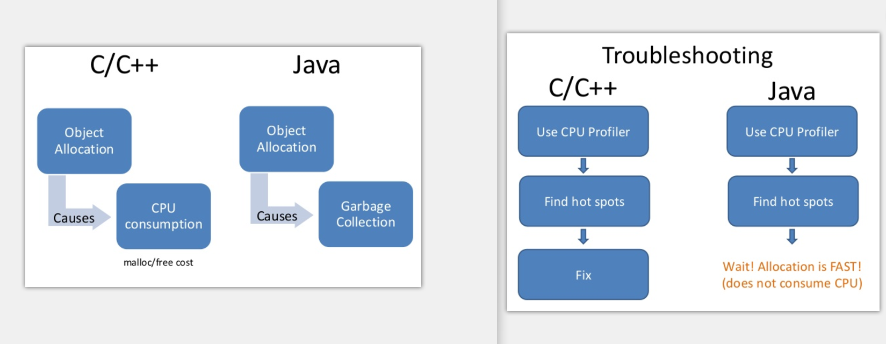
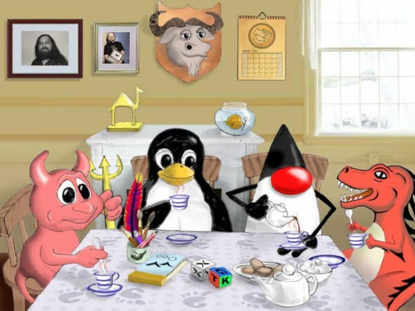

# 第二章

* 101道生机器语言，机器语言生汇编器，汇编器生编译器，编译器生上万种高级语言。

---

* 102 编程是一种事物，事物均有其道，编程也是，有之以为利，无之以为用。

---

* 103 源码阅读：好的作品要拿来抄，临摹高手作品。

---

* 104 虽然技术解决了公司的问题，但是解决了自己的问题吗？ 

---

* 105 技术二深：技术本身深，自我认识深。技术两广：技术本身广，自我外延广。

---

* 106 对技术有用没用的认知折射一个人对有用没用本身的思考。人们对事物的认知很少从有用没用为出发点开始思考，而是利益，对我有利就是有用。天底下，无用之事多如牛毛...二元论....

---

* 107 一种通用模式：用**函数对象\[通常为接口+泛型\]**作为**策略**。

常用的有:Comparable，Comparator，Listner\[ContextListener,ServletContextListener，EventListener\]，Predicate\[Guava,JDK8\]，Filter\[FilenameFilter ，Servelt Filter接口\]，Function\[JDK8\]，Functor，RowCallbackHandler\[JdbcTemplate\]，XXXCallback....

---

* 108 广义模式的书：POSA\[面向资源的软件架构1-5\]，PLoPD\[程序设计的模式语言1-5\]

---

* 109 模式中的模式，编写模式的模式语言。

---

* 110 GoF模式不是最有用，也不是最本质的，只是较早归纳写在书中。

---

* 111 不到native决不罢休，难道到了native就该停了？

---

* 112 每当把类图画成妙龄少女，就有看源码的冲动了。

---

* 113 脱光代码比脱光少女更有意思。

---

* 114  抄完源码一份代码就成了两份代码了。手抄Spring源码???这点可以学习顾炎武手抄资治通鉴。

---

* 115 编程，学习，读书是件老老实实的事，必须认真忠实地对待它。

---

* 116 大多数人对编程认识止于职业认识。因为启蒙时间太晚了。

---

* 117  一件事做十年还是五年还是一年还是百年，其思考角度会不同。 编程暂时只有7年之心。

---

* 118 任何事物都是对象是近20年来最强大的技术。任何事物都是模型是MDE/MDA的中心原则。

Object isInstanceOf Class,System isRepresentedBy Model.

---

* 119  面向对象技术：

---

* 120 也许学习Java的一个终极目的是学习面向对象技术。而非详尽其API。详尽其技术实现。

---

* 121 技术发展轨迹:

  我的学习思考：纯Java,Web -》 Patterns- 》Framework- 》MDD，DDD，MDA

---

* 122 如何判断一项技术的发展趋势？在没人用，在没知名度，在没业界背书的情况下？

---

* 123 一家技术先进与否取决于三点：1  **业务**是否先进，复杂    2  团队技术**理念**是否先进，超前。   3 **Leader**是否有执行力和想象力将理念实现，变现。

---

* 124  知道一个技术名词和理解他和码出他是三件不同的事。

---

* 125 前端技术虽然层出不穷，但是方向是模块化，傻瓜化，一统化。百家争鸣，启蒙时代，文艺复兴是对历史现象的高度概括。思考的暂时结论，而不要有结果。

---

* 126 任何变化的东西事物其不变的一面。

---

* 127 经常陷入变化产生现象的思考，而缺乏变化本身的思考。从E = MC^2 看变化是时间和空间的产物。

---

* 128 技术变化两要素，技术本身变化\[简单为理解版本更新\]，社会变革。后者是变化关键。

---

* 129 面试前最起码要：搜索enhancements in java se 8 或者 collections framework enhancements in java se 8。

  其次进入JEP180，JEP155，最后看源码的变更。

---

* 130 每使用一个API，要知道其变更记录。每使用一个技术，要追根溯源。\[JEPS,JSR\]

---

* 131 软件业的一条发展主线：建立一种可重复应用的东西。以及制造出一种“可重复应用的东西”的方法。子程序，程序，函数，类，函数库，类库，组件，结构化设计，模块化设计，oo设计，模式.....

---

* 132 伟大的软件来自伟大的程序员，而不是劳苦工作的大众。

---

* 133 模式在分类\[[http://java-design-patterns.com\](http://java-design-patterns.com\)\]

**Architechtural:**API GateWay,Aggregator Microservices,CQRS,Data Bus, Data Transfer Object,Event Driven Architecture,Event Source,Hexagonal Architecture, Layers, Naked Objects, Server Layer

**Behavioral:**Chain of Responsoibility, Command, Delegation, Dependency Injection, Extension Ojects, Feature Toggle, Intercepting Filter,Interpreter,Iterator,Mediator, Memeto,Null Object, Observer, Specification, State, Strategy, Template method, Visitor

**Bussiness Tier:**Bussiness Delegate

**Concurrency:**Async Method Invocation, Balking, Double Checked Locking,Event Queue, Event-based Asynchronous, Guarded Suspension,Half-Sync/Half-Async,Mutex,Producer-Consumer,Promise,Reactor,Reader Writer Lock,Semaphore, Thread Local Storage,Thread Pool

**Creational:**Abstract Factory,Builder,Factory Kit,Factory Method,Moudle,MonoState,Multiton,Object Mother,Object Pool,Property,Prototype,Singleton,Step Builder,Twin,Value Object

**Integration:**Message Channel,Publish-Subscribe,Tolerant Reader

**Other:**Caching,CallBack,Double Dispatch,Execute Around,Fluent Interface,Lazy Loading,Monad,Mute Idiom,Poison Pill,Private Class Data,Queue based load leveling,Resource Acquisition Is Initilazation

**Persistence Tier:**DAO,DataMapper,Repository

**Presentation Tier:**Flux,Front Controller,MVC,MVP

**Structural:**Abstract Document,Adapter,Bridge,Composite,Decorator,Event Aggregator,Facade,FlyWeight,Proxy,Servant,Service Locator

**Testing:**Page Object

---

134 模式wiki分类：

---

* 135 技术讲究顿悟与渐悟。

---

* 136 工作三年经验，还是一年经验用了三年，取决于是否领悟了道，是否更加认识了自己。君不见，朝闻道，夕死可矣。

---

* 137 编程三个老师：老子-学会遗忘，杜威-实用主义，斯托曼-自由精神。

---

* 138 为什么刻意拥有技术？刻意记住，不就是为了忘记吗？学习要东西结合。精确的数理科学+模糊不可言的东方哲学。以其不有，是为大有。忘记才是真正拥有。

---

* 139 庖丁解牛：先是深入细节，后是忘记细节，最后无形看到全牛。技术也必须深入细节，然后忘记细节。

---

* 140 问题驱动式的学习一个弊端在于容易忘记。兴趣驱动式的学习终究会成为自己的。两者间的协调是必要的。

---

* 141 你对技术理解有超越现实的价值存在吗？

---

* 142 技术有时候需要在现实和超越现实价值中做折中。我学习，因为探索的快乐，求知的渴望。即使没有问题驱动。

---

* 143 遇到问题去学其实是高效但容易健忘的学习方式。有一种虚假的错感，就是感觉“我会了”。

---

* 144 懂原理和懂面向对象是两个问题。面向对象最起码会UML+设计模式+面向对象原则。原理才会问HashMap原理。诚然，懂原理和写出优秀面向对象的程序没有必然联系。

---

* 145 根据业务来学要这么理解：学习技术方案才是根据业务来学。比如Kafka。

---

* 146 MySql 事务

---

* 147 JavaIO中最重要的两个设计模式：

  1 装饰器：一流多用。包装作用。

  2 适配器：兼容类库。字节流当做字符流使用。

---

* 148 JavaNio核心概念：Buffer + Channel

---

* 149 **易经**：形而上者谓之道,形而下者谓之器： -tor，-ter   翻译   为XXX-器或者XXX者  **\[器多好干活\]**
* **器\[拟物化\]：**  Listener 监听器  Adapter 适配器 Filter 过滤器 Iterator 迭代器  IntBuffer int视图缓冲器   Connector 连接器  Decortor 装饰器  Iterepter 解释器  Interceptor  拦截器  Reactor 反应器  Configurator 配置器  Wrapper 包装器 Proactor 主动器  Monitor 监视器   Controller 控制器  Translator 转换器  Acceptor 接收器 Selector 选择器   Container 容器 Manager 管理器 Evictor 驱逐器  Activator 激活器  Mapper 映射器   Locator  定位器 Handler 处理器  Assembler 汇编器  Driver 驱动器  Spliterator 分割器  Builder 构建器  Formatter 格式器  Scanner 扫描器  Timer 定时器   Converter 转化器  Dispatcher 分配器  Multicaster 广播器  Transfer 传输器   Desriptor 描述器  Encoder/Decoder 编码器/解码器  Introspector 内省器 Tokenizer 分词器 Loader 加载器 \(ClassLoader\)  Logger  记录器   Parser 解析器  Resolver 分解器 Incrementer 增加器/累加器  Counter 计数器  Collector 收集器  Initializer 初始化器  Setter 设置器 Getter 取值器 Marshaller  编组器UnMarshaller  解组器  Helper 帮助器/助手  Accessor 访问器/存取器  Visitor 访问器   Reflector 反射器  Serializer 序列器  Unserializer 反序列器  Embedder 嵌入器  Finalizer 回收器  Specifier 标识器  Supplier 供应器  Processor 处理器  Joiner 接合器 Recorder 记录器   Reducer 还原器/减少器   Analyzer 分析器  Invoker 调用器   Provider 供应器/提供者  Renderer 渲染器  Holder 存储器/持有器      Closer 关闭器  Operator 操作器   Appender 添加器  Printer 打印器  Tuplizer 元组器  Caller 调用器   Identifier 标识器  Walker 浏览器,漫步器\[DomWalker,DirectoryWalker\]   Brower 浏览器, Server 服务器   Aggregator 聚合器  Wokrer 工作器  Binder 绑定器   Validator 校验器  Finder 查找器 Launcher 发射器  Weaver 织入器   Messenger 信差/消息器  Modeler 模型器 Extractor 提取器\[InterfaceExtractorProcessor,MethodExtractor ,ClassExtractor \] Sampler 取样器  Profiler 分析器 Tracer 追踪器  Estimator 预估器，估计器   Generator 生成器   Instrumenter 插装器   Viewer 查看器  Cleaner 清除器  Debugger 调试器  Analyser 分析器   Inspector 检查器  Linker 链接器 Decompiler 反编译器   Editor 编辑器   Recognizer 识别器  Translator  解释器  Lexer 词法分析器   Tracker 追踪器   Constructor 构造器 Destructor 析构器  Executor 执行器  Synchronizer 同步器   Barrier  障碍器   Allocator 分配器\(Memory Allocator\)  Bundler 打包器  Applier 分发器    Trigger 触发器

* **者\[拟人化\]：**Consumer消费者  Producer 生产者  Observer 观察者  Caller 调用者 \[两种并没有太大区别，拟人化\]  Supervisor监管者   Overseer 监工  Javaer Java开发者  Keeper 管理员\[ZooKeeper\]

---

* 150 器可以理解为Idiom，也可以理解为模式。

---

* 151 GOF分类维度：**目的**\(创建-结构-行为\)和**范畴**\(类-对象\)。    POSA1分类维度：**模式类别**\(架构模式-设计模式-成例\)和**问题类别**\(从混沌到有序-分布式系统-交互式系统-可适应系统-结构分解-工作组织-访问控制-管理-通信-资源管理\)。

---

* 152 GOF在分类：

| 目的/范畴 | 类模式\(编译时确定\) | 对象模式\(运行时确定\) |
| :--- | :--- | :--- |
| 创建\(创建对象\) | 工厂方法 | 其他所有 |
| 结构\(组合类和对象\) | 类适配器 | 其他所有 |
| 行为\(类和对象交互以及职责分配\) | 解释器，模板方法 | 其他所有 |

---

* 153 真实世界的**Visitor**模式\[出自Apt处理注解需要的tools.jar\]

---

* 154 架构分类：

---

* 155 响应式宣言：

---

* 156 DTrace Toolkit 工具图

---

* 157 IO

一种新的类结构表示法

---

* 158  lang

---

* 159  reflect

---

* 160 math

---

* 161  net

---

* 162   text

---

* 163  util

---

* 164 util.zip

---

* 165 用户体验5大要素

---

* 166 委派是实现设计模式的一项重要的基础技术，靠继承能实现多动态啊？

---

* 167 UML三大师：[Grady Booch](https://en.wikipedia.org/wiki/Grady_Booch)，[Ivar Jacobson](https://en.wikipedia.org/wiki/Ivar_Jacobson)，[James Rumbaugh](https://en.wikipedia.org/wiki/James_Rumbaugh)。三位方法学大师，软件业的教父人物。

---

* 168 有本叫《thinking in 大象》，说是可以走向技术自由的梦想之路。问：什么是技术自由的梦想之路？

---

* 169 Linus谈生活的意义：性，战争，linux。生存-》社会-》乐趣

---

* 170 技术社会家：Richard Stallman，Aaron Swartz -  技术和政治以及社会运动的结合作品。

---

* 171 Aaron Swartz：为理念而献身的技术家。

---

* 172 Why GC is eating all my CPU?  you should measure who is eating . but you can not manage what you can not measure. So Let us instrument bytecodes. Use aprof.

---

* 173 有意思的C/C++和Java对比

---

* 174 JavaAPI具备自解释性。必须很熟练。量产生质。

---

* 175 java.lang.Comparable可比较的，java.util.Comparator是比较器。Comparable优于Comparator进行设计。

---

* 176 一般类名后面+s 说明是一个工具类，一般包含大量静态方法和静态属性。

JDK：Arrays，Objects，Beans，Channels\[工厂\]，Spliterators，

Guava：Charsets，Defaults，Enums，Equivalences，Functions，Objects，Predicates，Strings，Suppliers，Throwables，Interners，Iterables，Iterators，Lists，Maps，Multimaps，Multisets，ObjectArrays，Ranges，Sets.........

---

* 177 Java的问题的答案可深可浅。 equals，comparable。语言基础的方法。

---

* 178 学习JVM时候，一定要想为什么这么设计？为什么这么设计数据结构？当然想也想不出来啥。

---

* 179  [JavaAPI](http://docs.oracle.com/javase/8/docs/api/)进阶： 1 百度其用法，菜鸟教程，看api，[java2s](http://www.java2s.com)   》  2  官方[Tutorials](https://docs.oracle.com/javase/tutorial/)    》  3  源码[测试](http://hg.openjdk.java.net/jdk8/jdk8/jdk/file/687fd7c7986d/test)   》  4 [源码](http://hg.openjdk.java.net/jdk8/jdk8/jdk/file/687fd7c7986d/src) 

---

* 180 

---

* 181 JavaNio之linux实现\([参考资料](http://hellojava.info/?p=498)\)：

[EPollArrayWrapper.c](http://hg.openjdk.java.net/jdk8/jdk8/jdk/file/687fd7c7986d/src/solaris/native/sun/nio/ch)  ,  [EPollArrayWrapper ](http://hg.openjdk.java.net/jdk8/jdk8/jdk/file/687fd7c7986d/src/solaris/classes/sun/nio/ch)  [eventpoll.c](https://code.woboq.org/linux/linux/fs/eventpoll.c.html)     [wait.h](https://code.woboq.org/linux/linux/include/linux/wait.h.html)

---

* 182 You can only manage and improve on what you can measure....

---

* 183 学习封装多类库的例子\(通用日志接口,抽象日志类库的思想\)： common.log  与 SLF4J 。  具体的日志实现 log4j，java.util.logging，logback。jcl\(common log\) jul\(java.util.log\) ,juz\(java.util.zip\)

---

* 184 应用级的Facade模式：SLF4J\(Simple Logging Facade for Java\)

---

* 185 用户体验不是说按钮放对位置，界面花哨点，或者说解决用户的问题。而是帮助用户学习新的知识。学习用户体验不会让你代码水平有多大提高，而会让你对系统的思考更加全面。

---

* 186 没事看api，找好玩的方法。  [jdk8 ](http://docs.oracle.com/javase/8/docs/api/)  [j2ee6](http://docs.oracle.com/javaee/6/api/)

---

* 187 marker interface：

* java.lang.Cloneable

* java.io.Serializable

* java.util.RandomAccess java.util.EventListener

* java.util.concurrent.CompletableFuture.AsynchronousCompletionTask

* javax.xml.stream.events.EndDocument

* javax.management.loading.PrivateClassLoader

* java.security.KeyStore.Entry

* java.security.KeyStore.LoadStoreParameter

* java.security.KeyStore.ProtectionParameter

* java.security.Policy.Parameters

* javax.security.auth.callback.Callback

* javax.security.auth.login.Configuration.Parameters

---

* 188 内存管理最高水平：

glibc2.5\(未考虑多处理器\)   dlmalloc\(doug lea\)    ptmalloc3  hoard  concur  tcmalloc  jemalloc\(tengine,redis,可优化mysql,nginx\)

---

* 189  每周逛一逛各大出版社。

---

* 190 开源一家亲

---

* 191 沈询：技术有三个层次
* 第一个层次是：技术没有拖业务的后腿   
* 第二个层次是：技术帮业务拓展边界   
* 第三个层次是：技术驱动业务边界，我们都在路上。

---

* 192  沈询在谈到GTS时候说：GTS是怎么做到的？理解事务先理解db事务，在实现中做了哪些取舍，失去了什么，又带来了什么，在理解原理情况下，做出更多取舍，做出和业务贴合后更加符合业务诉求的方案。

---

* 193 学习原理是为了做出取舍，做出更加符合业务的技术方案。

---

* 194 设计模式观点：基于接口的复用，代码重载的方案。代码全部设计模式系统就完美了？满足业务场景业务诉求。不是什么神奇技术。

---

* 195 计算机分形观点：计算机解决问题都是从原始简单方案迭代成复杂系统，而这些_**微妙的变化**_就是优化的核心。有时候可以复用方案，有时候复用不了方案，不知道怎么变化的，就无法知道未来在哪里。 

---

* 196  数据库范式：大部分没有用到。范式解决的问题是尽可能减少数据冗余，怎么设计表结构合理，多对多关系有中间表，大量join操作，范式完美，但是效率低，是指导意见，但不是优秀方案。优秀方案是一个削足适履，脚在长出来的一个过程，往回看。

---

* 197  客户第一，拥抱变化，团队合作。谁是客户？客户要什么？客户满意度？领导满意度？3,4,5分是什么？超出预期又是什么？超出几份？

---

* 198 技术服务于业务是技术最终归宿。业务服务于客户是业务最终归宿。客户服务于自我需求是最终归宿。只不过每个人理解的业务层次不同。个人，业务就是一个模块。上级，业务就是一个职能单位，对于公司，就是生存之本，对于资本，就是一颗子弹。对于社会，就是一点推动力。

---

* 199 交流不是寻求认可，不是刻意攻击，不是自夸自擂，而是启发新思考。

---

* 200 当你一方面强于他人时候，不要认为别人菜。因为你也曾经被别人这么认为过。要思考他为什么这样，他的未来，他的前景，他可能的突破点。

---

